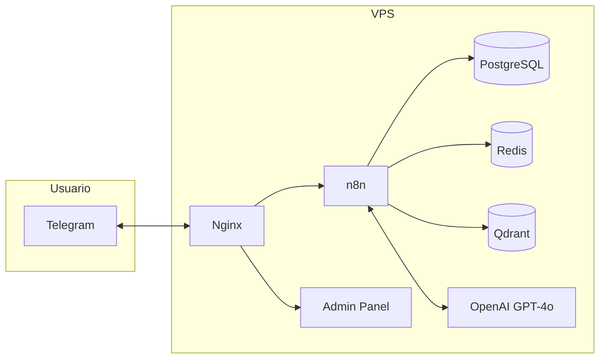

# FitAI Assistant

Asistente personal de nutrición y fitness por suscripción mensual que opera en Telegram. Ayuda a los usuarios a perder o ganar peso, mejorar su alimentación y construir rutinas de ejercicio mediante conversaciones naturales con un agente de IA.

---

## Propuesta de Valor

- **Coaching personalizado 24/7** a través de Telegram — sin apps adicionales
- **Planes de comidas** generados semanalmente según tus objetivos, preferencias y cultura gastronómica
- **Rutinas de ejercicio** adaptadas a tu nivel, equipo disponible y lesiones
- **Seguimiento de progreso** con indicadores calculados automáticamente
- **Motivación y coaching** basado en psicología del hábito
- **Precio accesible** comparado con un nutriólogo + entrenador personal

---

## Arquitectura



| Componente | Tecnología | Función |
|-----------|-----------|---------|
| Canal | Telegram Bot API | Comunicación con usuarios |
| Orquestación | n8n (self-hosted) | Toda la lógica de negocio |
| LLM | OpenAI GPT-4o | Conversaciones y generación de planes |
| Base de datos | PostgreSQL 16 | Datos persistentes |
| Caché | Redis 7 | Estado efímero (onboarding, rate limiting) |
| Vector store | Qdrant | RAG personal y de conocimiento |
| Panel admin | Express + EJS | Gestión de usuarios y membresías |
| Reverse proxy | Nginx | SSL, routing, rate limiting |
| Infraestructura | Docker Compose | Todos los servicios en una VPS |

---

## Requisitos del Sistema

| Recurso | Mínimo | Recomendado |
|---------|--------|-------------|
| vCPU | 2 | 4 |
| RAM | 4 GB | 8 GB |
| Almacenamiento | 40 GB SSD | 80 GB SSD |
| SO | Ubuntu 22.04 LTS | Ubuntu 22.04 LTS |

---

## Instalación Rápida

### 1. Clonar el Repositorio

```bash
git clone <repo-url> fitai-assistant
cd fitai-assistant
```

### 2. Configurar Variables de Entorno

```bash
cp .env.example .env
nano .env
# Llenar TODOS los valores requeridos (ver .env.example para descripciones)
```

Valores que necesitas obtener primero:
- **OPENAI_API_KEY**: Obtener en https://platform.openai.com/api-keys
- **TELEGRAM_BOT_TOKEN**: Crear bot con @BotFather en Telegram (ver sección siguiente)
- **Secrets**: Generar con `openssl rand -hex 32`

### 3. Crear el Bot de Telegram

1. Abrir Telegram y buscar **@BotFather**
2. Enviar `/newbot`
3. Seguir las instrucciones (nombre y username del bot)
4. Copiar el token generado → `TELEGRAM_BOT_TOKEN` en `.env`
5. Enviar `/setdescription` para agregar descripción
6. Enviar `/setabouttext` para agregar texto "acerca de"
7. Enviar `/setcommands` con:
   ```
   start - Iniciar el asistente
   plan - Ver mi plan actual
   progreso - Ver mi progreso
   ayuda - Ayuda y comandos disponibles
   ```

### 4. Levantar los Servicios

```bash
# Levantar PostgreSQL primero
docker compose up -d postgres
sleep 10

# Verificar que está listo
docker compose exec postgres pg_isready -U fitai

# Levantar el resto
docker compose up -d

# Verificar estado
docker compose ps
```

### 5. Inicializar la Base de Datos

```bash
docker compose exec -T postgres psql -U fitai -d fitai_db < migrations/001_initial_schema.sql
```

### 6. Crear Colecciones en Qdrant

```bash
curl -X PUT http://localhost:6333/collections/knowledge_rag \
  -H "Content-Type: application/json" \
  -d '{ "vectors": { "size": 1536, "distance": "Cosine" } }'

curl -X PUT http://localhost:6333/collections/user_rag \
  -H "Content-Type: application/json" \
  -d '{ "vectors": { "size": 1536, "distance": "Cosine" } }'
```

### 7. Configurar n8n

1. Abrir `http://localhost:5678` en el navegador
2. Crear cuenta de n8n
3. Ir a **Settings** → **API** → generar API key → copiar a `N8N_API_KEY` en `.env`
4. Configurar credenciales: OpenAI, Telegram, PostgreSQL, Redis, Qdrant
5. Importar workflows desde `n8n/workflows/` (ver orden en `n8n/workflows/README.md`)
6. Activar los workflows

### 8. Configurar Webhook de Telegram

```bash
curl -X POST "https://api.telegram.org/bot${TELEGRAM_BOT_TOKEN}/setWebhook" \
  -H "Content-Type: application/json" \
  -d "{
    \"url\": \"https://tudominio.com/webhook/fitai-telegram\",
    \"secret_token\": \"${TELEGRAM_WEBHOOK_SECRET}\",
    \"allowed_updates\": [\"message\", \"callback_query\"]
  }"
```

### 9. Crear Primer Administrador

```bash
docker compose exec admin-panel node scripts/create-admin.js \
  --email admin@tudominio.com \
  --password "contraseña-segura" \
  --name "Admin Principal"
```

### 10. Acceder al Panel Admin

- Desarrollo: `http://localhost:3000`
- Producción: `https://tudominio.com/admin/`

---

## Configuración de n8n

### Credenciales Necesarias

| Credencial | Tipo | Datos |
|-----------|------|-------|
| OpenAI | OpenAI API | API Key |
| Telegram | Telegram Bot | Bot Token |
| PostgreSQL | Postgres | Host, Port, User, Password, Database |
| Redis | Redis | Host, Port |
| Qdrant | HTTP Header Auth | URL, API Key (opcional) |

### Workflows del Sistema

| # | Workflow | Función |
|---|---------|---------|
| 1 | FitAI - Telegram Webhook Handler | Recibe mensajes, verifica membresía, enruta |
| 2 | FitAI - Main AI Agent | Agente GPT-4o con tools y memoria |
| 3 | FitAI - Onboarding Flow | Registro de nuevos usuarios |
| 4 | FitAI - Meal Plan Generator | Genera planes de comidas |
| 5 | FitAI - Meal Reminder Scheduler | Recordatorios de comidas (cron) |
| 6 | FitAI - Weight Update Requester | Solicita peso semanal (cron) |
| 7 | FitAI - Progress Calculator | Calcula indicadores de progreso |
| 8 | FitAI - Workout Plan Generator | Genera rutinas de ejercicio |
| 9 | FitAI - RAG Personal Indexer | Indexa info personal en Qdrant |
| 10 | FitAI - Membership Alert | Alerta de membresías por vencer (cron) |

---

## Estructura del Repositorio

```
fitai-assistant/
├── CLAUDE.md                 # Instrucciones para Claude Code
├── README.md                 # Este archivo
├── .mcp.json                 # Config de MCPs para Claude Code
├── .env.example              # Template de variables de entorno
├── docker-compose.yml        # Stack completo de servicios
├── infra/
│   └── nginx.conf            # Reverse proxy
├── docs/
│   ├── architecture.md       # Arquitectura técnica
│   ├── data-models.md        # Modelos de datos y SQL
│   ├── n8n-flows.md          # Documentación de workflows
│   ├── api-integrations.md   # Integraciones externas
│   ├── admin-panel.md        # Panel de administración
│   ├── deployment.md         # Guía de despliegue
│   └── project-status.md     # Estado y próximos pasos
├── skills/                   # Base de conocimiento del agente
│   ├── nutrition.md          # Nutrición
│   ├── fitness.md            # Fitness
│   ├── habit-psychology.md   # Psicología del hábito
│   └── metrics-calculation.md # Funciones de cálculo
├── prompts/                  # Prompts del agente
│   ├── system-prompt.md      # System prompt principal
│   ├── onboarding.md         # Flujo de onboarding
│   ├── meal-plan-generation.md    # Generación de planes de comidas
│   └── workout-plan-generation.md # Generación de rutinas
├── n8n/workflows/            # Workflows exportados de n8n
├── admin-panel/              # Panel de administración (Express+EJS)
└── src/bot/handlers/         # Documentación de handlers
```

---

## Roadmap

### Fase 1 — MVP (actual)
- [x] Documentación completa del sistema
- [ ] Schema de base de datos implementado
- [ ] Workflows de n8n construidos
- [ ] Panel admin funcional
- [ ] Bot operativo con onboarding, planes y seguimiento
- [ ] Deploy en VPS con SSL

### Fase 2 — Mejoras
- [ ] Integración con pasarela de pagos (MercadoPago/Stripe)
- [ ] Análisis de fotos de comida con GPT-4o Vision
- [ ] Dashboard de métricas para el admin
- [ ] Notificaciones push de motivación personalizadas
- [ ] Soporte para múltiples idiomas

### Fase 3 — Escalabilidad
- [ ] n8n en queue mode con múltiples workers
- [ ] PostgreSQL gestionado (RDS/managed)
- [ ] CDN para assets del panel admin
- [ ] APM con Grafana + Prometheus
- [ ] API pública para integraciones

---

## Desarrollo Local

### Prerequisitos

- Docker y Docker Compose
- Node.js 20+ (para desarrollo del panel admin fuera de Docker)
- API key de OpenAI
- Bot de Telegram creado

### Levantar en Local

```bash
# Clonar
git clone <repo-url> && cd fitai-assistant

# Configurar
cp .env.example .env
# Editar .env con valores de desarrollo

# Levantar
docker compose up -d

# Ver logs
docker compose logs -f
```

### Desarrollo del Panel Admin

```bash
cd admin-panel
npm install
npm run dev  # Servidor con hot-reload
```

---

## Licencia

Pendiente de definir.
