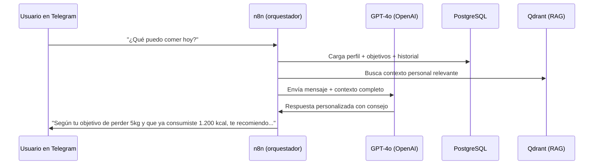
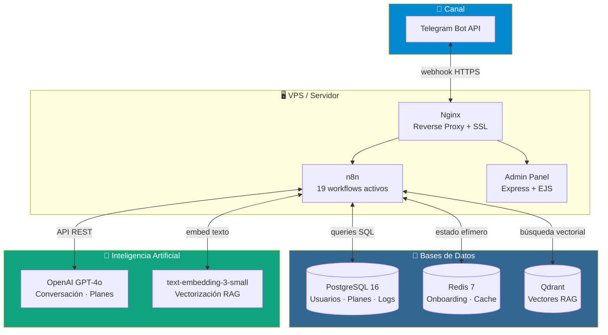
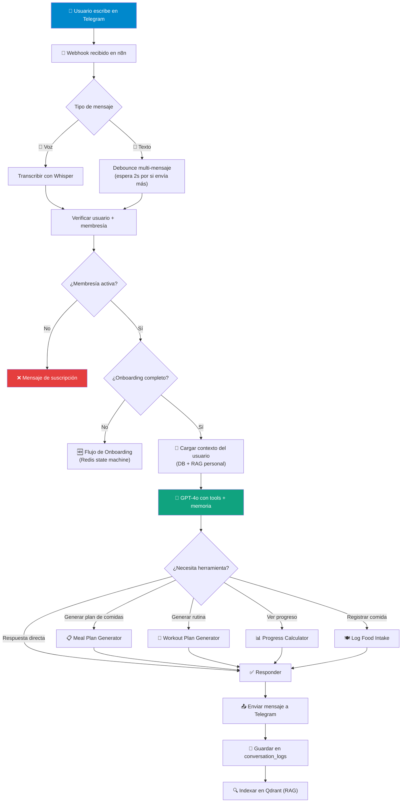
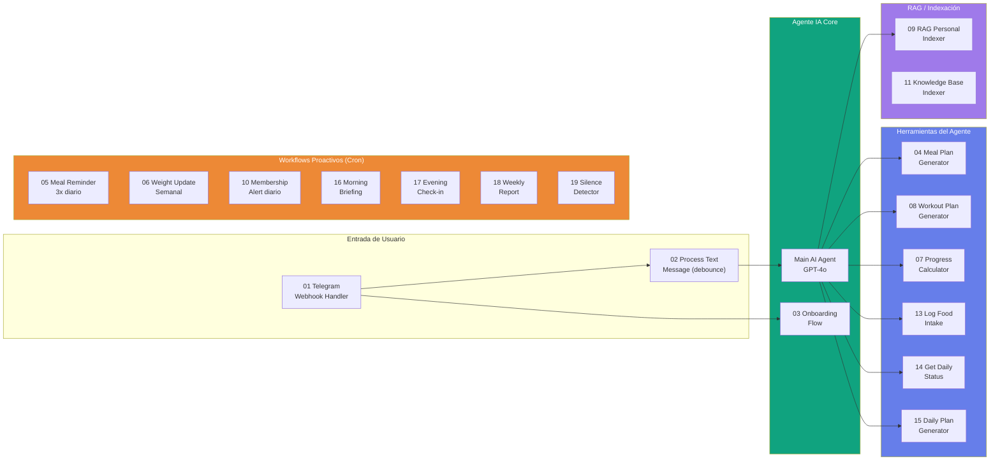
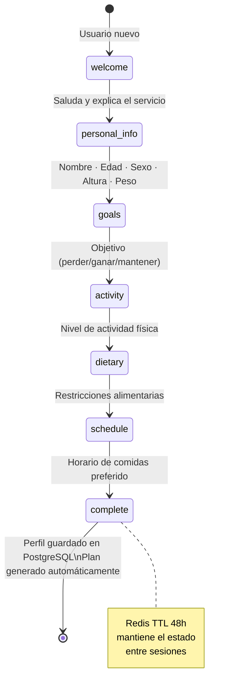
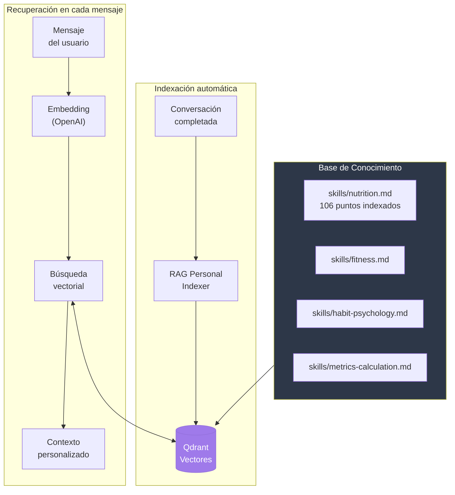

# FitAI Assistant

> Asistente personal de nutrición y fitness por suscripción mensual que opera **100% en Telegram** — sin apps, sin formularios, sin complicaciones.

El usuario habla con un agente de IA por Telegram. El agente conoce su perfil, sus metas, su historial de comidas, sus rutinas y su progreso. Responde como un nutriólogo y entrenador personal disponible 24/7.

---

## Cómo funciona en 30 segundos



---

## Propuesta de Valor

| Para el usuario | Para el negocio |
|----------------|----------------|
| Coaching 24/7 sin agendar citas | Escalable sin aumentar costos fijos |
| Planes de comidas semanales personalizados | Ingresos recurrentes por suscripción |
| Rutinas de ejercicio adaptadas | Automatización completa en n8n |
| Seguimiento de progreso automático | Panel admin para gestionar clientes |
| Motivación y recordatorios en Telegram | Sin app que mantener ni publicar |

---

## Arquitectura del Sistema



---

## Flujo Completo de un Mensaje



---

## Los 19 Workflows de n8n



---

## Sistema de Onboarding



---

## Sistema RAG (Memoria Inteligente)



---

## Stack Tecnológico

| Componente | Tecnología | Rol |
|-----------|-----------|-----|
| Canal | Telegram Bot API | Comunicación con usuarios |
| Orquestador | n8n 2.11.3 (Docker, SQLite) | Toda la lógica de negocio — 19 workflows |
| LLM | OpenAI GPT-4o | Conversaciones + generación de planes |
| Embeddings | text-embedding-3-small | Vectorización para RAG |
| Base de datos | PostgreSQL 16 | Usuarios, planes, logs, membresías |
| Caché / Estado | Redis 7 | Onboarding (TTL), debounce mensajes |
| Vector store | Qdrant 1.13.0 | RAG personal + base de conocimiento |
| Panel admin | Express 4 + EJS | Gestión de usuarios y membresías |
| Reverse proxy | Nginx 1.25 | SSL, routing, rate limiting |
| Infraestructura | Docker Compose 2 | Stack completo en una VPS |
| OS | Ubuntu 22.04 LTS | Servidor de producción |

---

## Requisitos del Sistema

| Recurso | Mínimo | Recomendado |
|---------|--------|-------------|
| vCPU | 2 | 4 |
| RAM | 4 GB | 8 GB |
| Almacenamiento | 40 GB SSD | 80 GB SSD |
| SO | Ubuntu 22.04 LTS | Ubuntu 22.04 LTS |

---

## Instalación Rápida

### 1. Clonar y configurar

```bash
git clone <repo-url> fitai-assistant
cd fitai-assistant
cp .env.example .env
# Llenar los valores en .env (ver sección Variables de Entorno)
```

Valores clave que obtener primero:
- **OPENAI_API_KEY** → platform.openai.com/api-keys
- **TELEGRAM_BOT_TOKEN** → crear bot con @BotFather en Telegram
- **Secrets** → `openssl rand -hex 32`

### 2. Crear el bot de Telegram

1. Abrir Telegram → buscar **@BotFather**
2. Enviar `/newbot` → seguir instrucciones
3. Copiar el token → `TELEGRAM_BOT_TOKEN` en `.env`
4. Configurar comandos con `/setcommands`:
   ```
   start - Iniciar el asistente
   plan - Ver mi plan actual
   progreso - Ver mi progreso
   ayuda - Ayuda y comandos
   ```

### 3. Levantar los servicios

```bash
docker compose up -d
docker compose ps  # Verificar que todo corre
```

### 4. Inicializar la base de datos

```bash
docker compose exec -T postgres psql -U fitai -d fitai_db < migrations/001_initial_schema.sql
```

### 5. Crear colecciones en Qdrant

```bash
curl -X PUT http://localhost:6333/collections/knowledge_rag \
  -H "Content-Type: application/json" \
  -d '{ "vectors": { "size": 1536, "distance": "Cosine" } }'

curl -X PUT http://localhost:6333/collections/user_rag \
  -H "Content-Type: application/json" \
  -d '{ "vectors": { "size": 1536, "distance": "Cosine" } }'
```

### 6. Configurar n8n

1. Abrir `http://localhost:5678`
2. Crear cuenta → **Settings → API** → generar API key → copiar a `N8N_API_KEY`
3. Configurar credenciales: OpenAI, Telegram, PostgreSQL, Redis, Qdrant
4. Importar workflows desde `n8n/workflows/` (ver orden en `n8n/workflows/README.md`)
5. Activar todos los workflows

### 7. Configurar webhook de Telegram

```bash
curl -X POST "https://api.telegram.org/bot${TELEGRAM_BOT_TOKEN}/setWebhook" \
  -H "Content-Type: application/json" \
  -d "{
    \"url\": \"https://tudominio.com/webhook/fitai-telegram\",
    \"secret_token\": \"${TELEGRAM_WEBHOOK_SECRET}\",
    \"allowed_updates\": [\"message\"]
  }"
```

### 8. Crear primer administrador

```bash
docker compose exec admin-panel node scripts/create-admin.js \
  --email admin@tudominio.com \
  --password "contraseña-segura" \
  --name "Admin Principal"
```

Panel admin disponible en:
- Desarrollo: `http://localhost:3000`
- Producción: `https://tudominio.com/admin/`

---

## Estructura del Repositorio

```
fitai-assistant/
├── CLAUDE.md                 # Instrucciones para Claude Code
├── README.md                 # Este archivo
├── .env.example              # Template de variables de entorno
├── docker-compose.yml        # Stack completo de servicios
├── infra/
│   └── nginx.conf            # Reverse proxy + SSL
├── docs/
│   ├── architecture.md       # Arquitectura técnica detallada
│   ├── data-models.md        # Modelos de datos, SQL, ER
│   ├── n8n-flows.md          # Documentación de los 19 workflows
│   ├── api-integrations.md   # Integraciones externas
│   ├── admin-panel.md        # Panel de administración
│   ├── deployment.md         # Guía de despliegue en VPS
│   └── project-status.md     # Estado actual y próximos pasos
├── skills/
│   ├── dev/                  # Guías de desarrollo para Claude Code
│   └── business/             # Base de conocimiento del agente IA
│       ├── nutrition.md
│       ├── fitness.md
│       ├── habit-psychology.md
│       └── metrics-calculation.md
├── prompts/
│   ├── system-prompt.md      # System prompt del agente OpenAI
│   ├── onboarding.md         # Flujo de onboarding
│   └── meal-plan-generation.md
├── n8n/workflows/            # 19 workflows exportados de n8n (JSON)
├── admin-panel/              # Panel admin (Express + EJS)
└── src/bot/handlers/         # Documentación de handlers
```

---

## Roadmap

### Fase 1 — MVP (en producción local, pendiente VPS)
- [x] 19 workflows de n8n operativos
- [x] Onboarding conversacional con Redis state machine
- [x] AI Agent con 7 tools (planes, progreso, log de comidas)
- [x] RAG personal automático post-conversación
- [x] 5 workflows proactivos (morning briefing, check-in, reporte semanal)
- [x] Panel admin básico (Express + EJS)
- [ ] Deploy en VPS con HTTPS

### Fase 2 — Mejoras
- [ ] Pasarela de pagos (MercadoPago / Stripe)
- [ ] Análisis de fotos de comida con GPT-4o Vision
- [ ] Dashboard de métricas en el panel admin
- [ ] Notificaciones push de motivación personalizadas

### Fase 3 — Escalabilidad
- [ ] n8n en queue mode con múltiples workers
- [ ] PostgreSQL gestionado (RDS / managed)
- [ ] APM con Grafana + Prometheus
- [ ] API pública para integraciones

---

## Licencia

Pendiente de definir.
