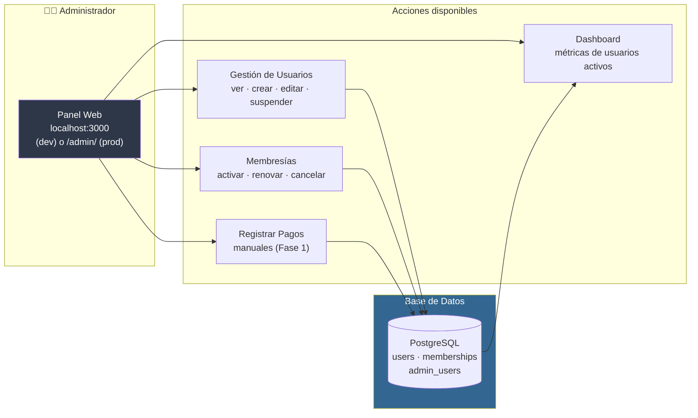
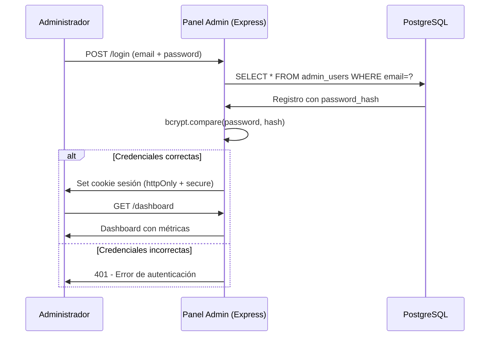
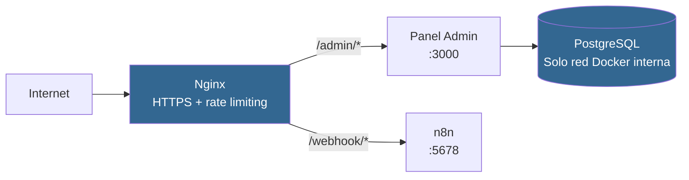

# Panel de Administración — FitAI Assistant

Panel web interno para gestionar usuarios, membresías y pagos del bot. Accesible solo para administradores, detrás de Nginx con HTTPS.

---

## Qué hace el Panel Admin



---

## Flujo de Autenticación



---

## Tecnología

Express.js + EJS + express-session + bcrypt + pg

| Decisión | Razón |
|----------|-------|
| Express + EJS | Mínimas dependencias, Docker image ~80MB |
| bcrypt (12 rounds) | Hashing seguro de contraseñas |
| express-session | Sesiones server-side sin JWT |
| pg (node-postgres) | Conexión directa a PostgreSQL |

---

## Instalación

### Con Docker (recomendado)

```bash
docker compose up -d admin-panel
```

### Desarrollo local

```bash
cd admin-panel
npm install
cp ../.env.example ../.env  # Configurar DATABASE_URL y ADMIN_PANEL_SECRET_KEY
npm run dev
```

---

## Variables de Entorno

| Variable | Descripción |
|----------|------------|
| `DATABASE_URL` | URL de conexión a PostgreSQL |
| `ADMIN_PANEL_SECRET_KEY` | Secret para cookies de sesión (`openssl rand -hex 32`) |
| `ADMIN_PANEL_PORT` | Puerto del panel (default: 3000) |
| `NODE_ENV` | `development` o `production` |

---

## Crear el Primer Administrador

No hay formulario de auto-registro por seguridad. El primer admin se crea via CLI:

```bash
# Con Docker
docker compose exec admin-panel node scripts/create-admin.js \
  --email admin@fitai.com \
  --password "contraseña-segura" \
  --name "Admin Principal"
```

El script hashea la contraseña con bcrypt (12 rounds) e inserta en `admin_users`.

---

## Acceso

| Entorno | URL |
|---------|-----|
| Desarrollo | `http://localhost:3000` |
| Producción | `https://tudominio.com/admin/` |

---

## Estructura del Proyecto

```
admin-panel/
├── Dockerfile              # node:20-alpine (~80MB)
├── package.json
├── app.js                  # Punto de entrada Express
├── config/
│   └── database.js         # Pool de conexión PostgreSQL
├── middleware/
│   ├── auth.js             # Verificación de sesión activa
│   └── errorHandler.js     # Manejo global de errores
├── routes/
│   ├── auth.js             # GET/POST /login, GET /logout
│   ├── dashboard.js        # GET /dashboard
│   ├── users.js            # CRUD /users
│   └── payments.js         # POST /payments
├── views/
│   ├── layout.ejs
│   ├── login.ejs
│   ├── dashboard.ejs
│   ├── users/
│   │   ├── index.ejs
│   │   ├── show.ejs
│   │   └── new.ejs
│   └── payments/
│       └── new.ejs
├── public/css/style.css
└── scripts/create-admin.js
```

---

## Seguridad en Producción



1. Panel accesible solo via `/admin/` detrás de Nginx
2. HTTPS obligatorio via Let's Encrypt
3. Cookie de sesión con `secure`, `httpOnly`, `sameSite: strict`
4. Rate limiting via nginx (`limit_req zone=admin_limit`)
5. PostgreSQL solo accesible dentro de la red Docker (sin puerto expuesto)
6. No hay rutas públicas excepto `/login` y `/health`

---

## Documentación Completa

Ver `docs/admin-panel.md` para documentación detallada incluyendo wireframes, endpoints, ejemplos de código e integración con PostgreSQL.
