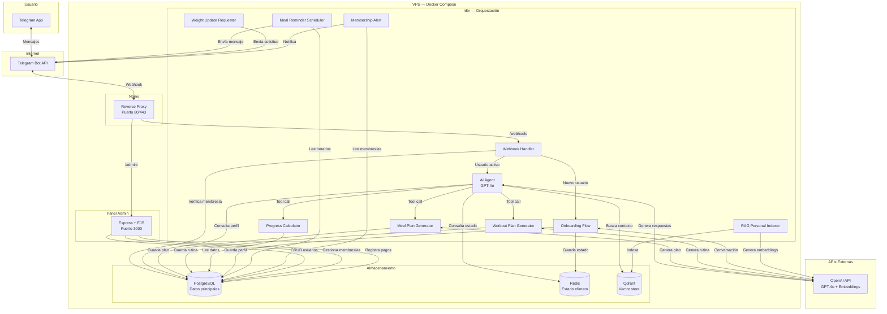
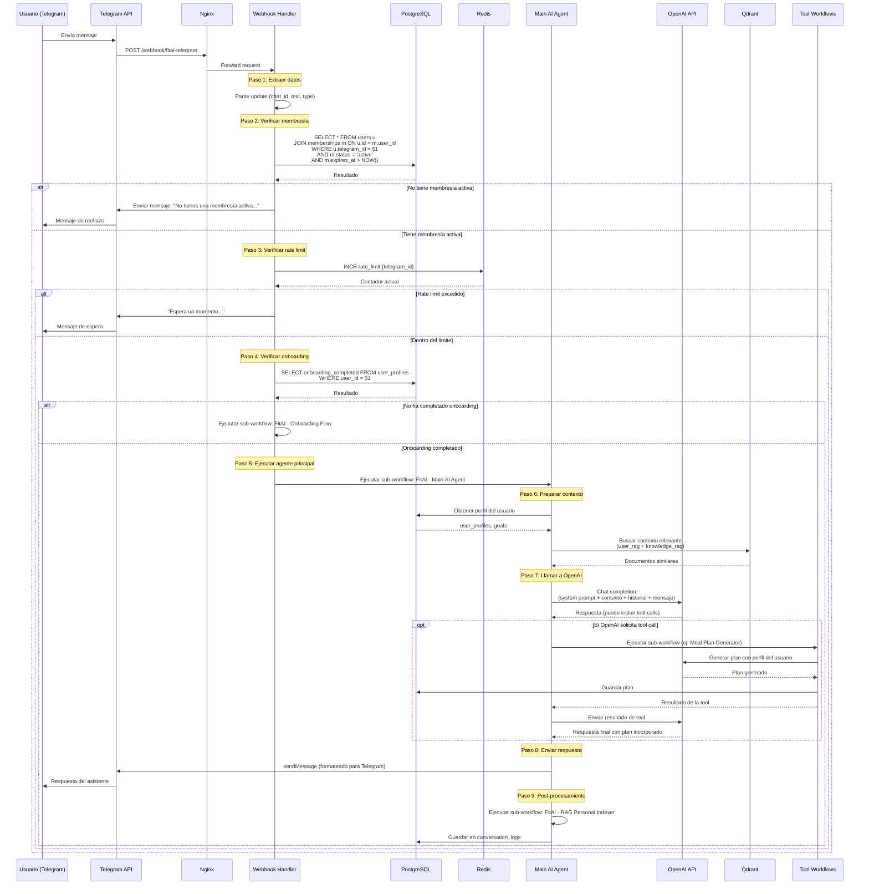
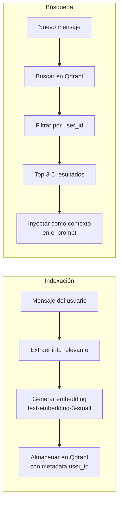

# Arquitectura Técnica — FitAI Assistant

## Visión General del Sistema

FitAI Assistant es un sistema de coaching de nutrición y fitness que opera a través de Telegram. Utiliza agentes de OpenAI (GPT-4o) orquestados por n8n para mantener conversaciones naturales con los usuarios, generar planes personalizados y hacer seguimiento de progreso.

---

## Diagrama General del Sistema



---

## Descripción de Componentes

### 1. Nginx (Reverse Proxy)

**Responsabilidad**: Punto de entrada único al sistema. Enruta tráfico, maneja SSL y aplica rate limiting.

| Ruta | Destino | Propósito |
|------|---------|-----------|
| `/webhook/` | n8n:5678 | Webhooks de Telegram |
| `/n8n/` | n8n:5678 | UI de n8n (desarrollo/admin) |
| `/admin/` | admin-panel:3000 | Panel de administración |

### 2. n8n (Orquestación)

**Responsabilidad**: Toda la lógica de negocio del bot. No existe un backend custom — n8n ES el backend.

Los 12 workflows del sistema:

| Workflow | Trigger | Función |
|----------|---------|---------|
| `FitAI - Telegram Webhook Handler` | Webhook (Telegram) | Recibe mensajes, verifica membresía, enruta |
| `FitAI - Process text message` | Sub-workflow (executeWorkflow) | Debounce multi-mensaje con PostgreSQL |
| `FitAI - Main AI Agent` | Sub-workflow | Agente OpenAI con tools, genera respuestas |
| `FitAI - Onboarding Flow` | Sub-workflow | Guía al nuevo usuario por el registro |
| `FitAI - Meal Plan Generator` | Tool del agente | Genera plan de comidas personalizado |
| `FitAI - Meal Reminder Scheduler` | Cron (3x diario) | Envía recordatorios de comidas |
| `FitAI - Weight Update Requester` | Cron (semanal) | Solicita actualización de peso |
| `FitAI - Progress Calculator` | Tool del agente | Calcula y reporta progreso |
| `FitAI - Workout Plan Generator` | Tool del agente | Genera rutina de ejercicio |
| `FitAI - RAG Personal Indexer` | Post-conversación | Indexa información relevante en Qdrant |
| `FitAI - Knowledge Base Indexer` | Webhook (manual) | Indexa skills de negocio en knowledge_rag |
| `FitAI - Membership Alert` | Cron (diario) | Alerta de membresías por vencer |

### 3. PostgreSQL (Base de Datos)

**Responsabilidad**: Almacenamiento persistente de todos los datos del sistema.

Tablas principales: `users`, `memberships`, `payment_logs`, `user_profiles`, `goals`, `meal_plans`, `exercise_plans`, `weight_logs`, `conversation_logs`, `admin_users`, `message_buffer`.

La tabla `message_buffer` (migración 005) almacena el estado efímero del debounce multi-mensaje: `chat_id`, `text` acumulado, `last_ts` del último escritor.

Compartida entre n8n (a través de nodos PostgreSQL) y el panel admin (a través de la librería `pg`).

### 4. Redis (Caché)

**Responsabilidad**: Estado efímero que no requiere persistencia a largo plazo.

| Key Pattern | Propósito | TTL |
|-------------|-----------|-----|
| `onboarding:{telegram_id}` | Estado del flujo de onboarding (paso actual, respuestas parciales) | 24 horas |
| `rate_limit:{telegram_id}` | Contador de mensajes por minuto | 60 segundos |

Si Redis se cae, los usuarios en medio del onboarding deberán reiniciar el proceso, pero no se pierde data persistente.

### 5. Qdrant (Vector Store)

**Responsabilidad**: Almacenamiento y búsqueda de embeddings para RAG (Retrieval-Augmented Generation).

| Colección | Contenido | Filtro |
|-----------|-----------|--------|
| `knowledge_rag` | Conocimiento general de nutrición, fitness y coaching | `category`, `subcategory` |
| `user_rag` | Información personal extraída de conversaciones | `user_id`, `type`, `date` |

Embeddings generados con `text-embedding-3-small` (1536 dimensiones).

### 6. Panel Admin (Express + EJS)

**Responsabilidad**: Interfaz web para que los administradores gestionen usuarios, membresías y pagos de forma manual.

- Autenticación por sesión (bcrypt + express-session)
- CRUD de usuarios y membresías
- Registro manual de pagos
- Activación/desactivación del acceso al bot en tiempo real
- Dashboard con métricas globales

### 7. OpenAI API (Servicio Externo)

**Responsabilidad**: Provee la inteligencia del agente en producción.

| Modelo | Uso | Costo Aprox. |
|--------|-----|-------------|
| `gpt-4o` | Conversaciones, generación de planes, onboarding | ~$0.15-0.30 por usuario/día activo |
| `text-embedding-3-small` | Generación de embeddings para RAG | ~$0.01 por 1M tokens |

---

## Flujo Completo Request-Response

Desde que el usuario envía un mensaje en Telegram hasta que recibe la respuesta:



---

## Sistema de Verificación de Membresía

El bot verifica la membresía en **cada interacción**, antes de procesar cualquier mensaje:

```mermaid
flowchart TD
    A[Mensaje entrante] --> B{¿Existe el usuario<br/>en la tabla users?}
    B -->|No| C[Responder: Contacta al admin<br/>para activar tu cuenta]
    B -->|Sí| D{¿Tiene membresía<br/>con status = 'active'?}
    D -->|No| E{¿Tiene membresía<br/>con status = 'expired'?}
    E -->|Sí| F[Responder: Tu membresía expiró.<br/>Contacta al admin para renovar.]
    E -->|No| G[Responder: No tienes membresía activa.]
    D -->|Sí| H{¿expires_at > NOW()?}
    H -->|No| I[Actualizar status a 'expired']
    I --> F
    H -->|Sí| J[Procesar mensaje normalmente]
```

La verificación es una query SQL simple que se ejecuta en el nodo PostgreSQL del `Webhook Handler`:

```sql
SELECT u.id, u.telegram_id, u.first_name,
       m.plan_type, m.status, m.expires_at
FROM users u
LEFT JOIN memberships m ON u.id = m.user_id
  AND m.status = 'active'
  AND m.expires_at > NOW()
WHERE u.telegram_id = $1
ORDER BY m.expires_at DESC
LIMIT 1;
```

---

## Patrón de Agente OpenAI en n8n

### Configuración del AI Agent Node

El nodo **AI Agent** de n8n se configura de la siguiente forma:

1. **Modelo**: OpenAI GPT-4o
   - Temperature: 0.7 (balance entre creatividad y consistencia)
   - Max tokens: 1024 (suficiente para respuestas conversacionales)

2. **System Prompt**: Se inyecta desde `prompts/system-prompt.md` con variables dinámicas:
   - `{{userName}}` — nombre del usuario
   - `{{userProfile}}` — JSON del perfil completo
   - `{{currentDate}}` — fecha actual
   - `{{ragContext}}` — documentos relevantes de Qdrant

3. **Window Buffer Memory**: Mantiene las últimas 10 interacciones (20 mensajes: 10 del usuario + 10 del asistente) para contexto conversacional. Se almacena en la base de datos de n8n.

4. **Tools (funciones que el agente puede invocar)**:
   - `generate_meal_plan` → ejecuta `FitAI - Meal Plan Generator`
   - `generate_workout_plan` → ejecuta `FitAI - Workout Plan Generator`
   - `calculate_progress` → ejecuta `FitAI - Progress Calculator`
   - `search_knowledge` → busca en Qdrant colección `knowledge_rag`
   - `get_user_history` → busca en Qdrant colección `user_rag` filtrado por `user_id`
   - `log_weight` → inserta registro en `weight_logs`
   - `get_current_plan` → lee el plan activo de `meal_plans` o `exercise_plans`

### Cómo se Definen las Tools

En n8n, las tools del AI Agent se definen como:
- **Sub-workflows**: workflows independientes que reciben parámetros y retornan resultados. El agente los invoca automáticamente cuando determina que necesita ejecutar esa acción.
- **HTTP Request nodes**: para llamadas directas a APIs (ej: Qdrant search).
- **Code nodes**: para cálculos locales (ej: IMC, TMB).

### Cómo Funciona la Memoria

```
Window Buffer Memory (últimas 10 interacciones)
   ↓
Se inyecta como parte del contexto del chat
   ↓
OpenAI recibe: system prompt + memoria + RAG context + mensaje actual
   ↓
Genera respuesta (posiblemente con tool calls)
```

---

## Estrategia de RAG

### RAG de Conocimiento (`knowledge_rag`)

Contiene información general de nutrición, fitness y coaching que NO es específica de ningún usuario:

- Datos nutricionales de alimentos comunes
- Principios de entrenamiento
- Guías de progresión
- Contenido de los archivos `skills/*.md`

**Indexación**: Se ejecuta una sola vez al desplegar el sistema (o cuando se actualiza el contenido de skills). Los documentos se dividen en chunks de ~500 tokens, se generan embeddings y se almacenan en Qdrant con metadata de `category` y `subcategory`.

**Búsqueda**: El agente busca con el texto del mensaje del usuario, filtrando por categoría relevante. Retorna los 3-5 documentos más similares.

### RAG Personal (`user_rag`)

Contiene información específica de cada usuario, extraída de sus conversaciones:

- Preferencias alimentarias mencionadas
- Alergias o restricciones descubiertas
- Logros y hitos reportados
- Emociones y estados de ánimo expresados
- Recetas favoritas
- Patrones de comportamiento

**Indexación**: Después de cada conversación significativa, el workflow `FitAI - RAG Personal Indexer` extrae información relevante, genera un resumen, crea el embedding y lo almacena con metadata del `user_id`.

**Búsqueda**: Siempre filtrada por `user_id`. El agente busca contexto personal antes de responder para personalizar sus respuestas.



---

## Decisiones de Arquitectura (ADRs)

### ADR-1: OpenAI GPT-4o como LLM de producción (dentro de n8n)

**Contexto**: Se necesita un LLM capaz de conversaciones naturales, function calling y seguimiento de instrucciones complejas.

**Decisión**: Usar OpenAI GPT-4o a través de los nodos nativos de n8n (AI Agent, OpenAI Chat Model).

**Justificación**:
- n8n tiene integración nativa con OpenAI (nodos AI Agent configurables sin código)
- GPT-4o tiene el mejor soporte de function calling del mercado
- El modelo es multilingüe y maneja español con alta calidad
- La API es estable y con SLAs de disponibilidad
- Costo razonable para un servicio de suscripción (~$0.15-0.30 por usuario activo/día)

**Consecuencias**: Dependencia de OpenAI. Si OpenAI tiene downtime, el bot no puede responder. Mitigación futura: implementar fallback a otro modelo.

### ADR-2: Qdrant como Vector Store

**Contexto**: Se necesita almacenamiento y búsqueda de vectores para RAG, tanto para conocimiento general como para memoria por usuario.

**Decisión**: Usar Qdrant self-hosted.

**Justificación**:
- Self-hosted: sin costos adicionales ni dependencia de servicios externos
- Soporte nativo en n8n (nodo Qdrant Vector Store)
- Filtrado por metadata (esencial para filtrar por `user_id` en RAG personal)
- Bajo consumo de recursos para volúmenes pequeños-medianos
- Docker image oficial y estable

**Versión requerida: `qdrant/qdrant:v1.13.0` (mínimo 1.10.0)**
El paquete `@langchain/qdrant@1.0.1` que usa n8n 2.11.3 llama a `POST /collections/{name}/points/query` (Universal Query API), que solo existe en Qdrant ≥ 1.10.0. Con versiones anteriores (ej: 1.7.4) el nodo `vectorStoreQdrant` en modo `retrieve-as-tool` falla con `NodeOperationError: Not Found`.

**Alternativas consideradas**:
- Pinecone: SaaS, costos mensuales innecesarios para volúmenes pequeños
- ChromaDB: Menos maduro, sin nodo nativo en n8n
- pgvector: Posible pero mezcla concerns; Qdrant tiene mejor rendimiento para búsqueda vectorial

### ADR-3: Gestión Manual de Pagos en Fase 1

**Contexto**: El sistema necesita control de acceso por suscripción, pero integrar una pasarela de pagos es complejo y tiene requisitos regulatorios.

**Decisión**: Los pagos se gestionan 100% manualmente. Un admin registra el pago en el panel, asigna el plan y la fecha de expiración.

**Justificación**:
- Elimina la complejidad de integrar Stripe/MercadoPago en el MVP
- Evita requisitos regulatorios (facturación electrónica, cumplimiento fiscal)
- Permite lanzar rápidamente y validar el producto
- El panel admin hace el proceso sencillo (1-2 minutos por usuario)

**Ruta de salida**: En Fase 2, integrar MercadoPago o Stripe con webhooks en n8n para automatizar el cobro y la activación.

---

## Estrategia de Escalabilidad (Fase 3)

Para cuando el sistema supere los 500 usuarios activos simultáneos:

1. **Separar n8n en instancias por tipo de workflow**: webhooks en una instancia, cron jobs en otra, usando n8n queue mode con Redis como broker
2. **Mover PostgreSQL a un servicio gestionado** (AWS RDS, DigitalOcean Managed DB) para backups automáticos y alta disponibilidad
3. **Agregar un segundo nodo de Qdrant** para replicación y mayor rendimiento de búsqueda
4. **Implementar CDN** para el panel admin (assets estáticos)
5. **Agregar APM** (Application Performance Monitoring) con Grafana + Prometheus para identificar cuellos de botella
6. **Considerar migración a Kubernetes** si se requiere auto-scaling horizontal
