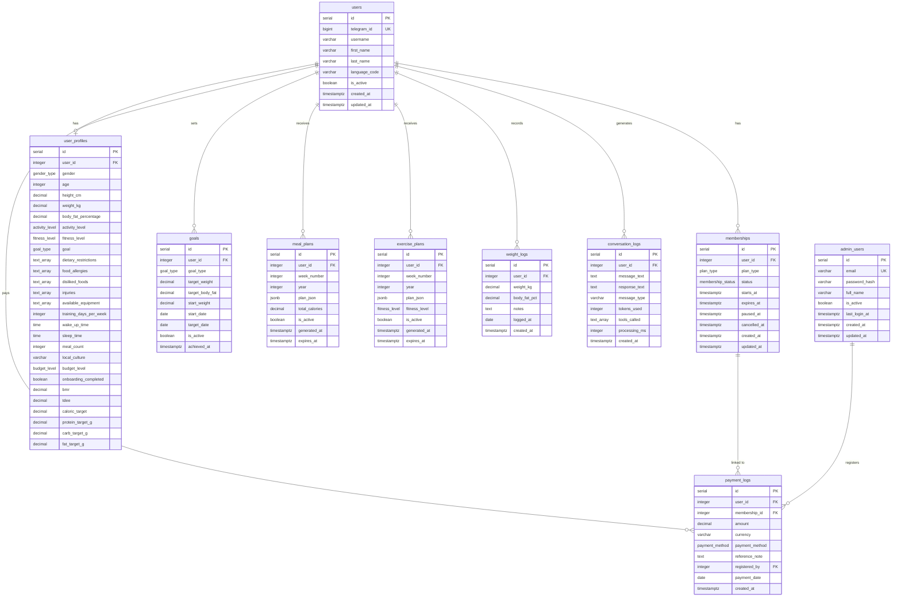

# Modelos de Datos — FitAI Assistant

## Schema SQL Completo (PostgreSQL 16)

### Tipos Enumerados

```sql
-- Membership status lifecycle: trial → active → expired/paused/cancelled
CREATE TYPE membership_status AS ENUM ('trial', 'active', 'expired', 'paused', 'cancelled');

-- Subscription plan tiers
CREATE TYPE plan_type AS ENUM ('basic', 'pro', 'premium');

-- User biological gender (for metabolic calculations)
CREATE TYPE gender_type AS ENUM ('male', 'female');

-- Fitness goal categories
CREATE TYPE goal_type AS ENUM ('lose_weight', 'gain_muscle', 'maintain', 'recomposition');

-- Activity level for TDEE calculation
CREATE TYPE activity_level AS ENUM ('sedentary', 'lightly_active', 'moderately_active', 'very_active', 'extra_active');

-- Fitness experience level
CREATE TYPE fitness_level AS ENUM ('beginner', 'intermediate', 'advanced');

-- User budget level for ingredient selection
CREATE TYPE budget_level AS ENUM ('low', 'medium', 'high');

-- Payment method used
CREATE TYPE payment_method AS ENUM ('transfer', 'cash', 'card', 'other');
```

### Tabla: `users`

Tabla principal de usuarios. Cada usuario se identifica por su `telegram_id`.

```sql
CREATE TABLE users (
    id              SERIAL PRIMARY KEY,
    telegram_id     BIGINT UNIQUE NOT NULL,
    username        VARCHAR(255),
    first_name      VARCHAR(255) NOT NULL,
    last_name       VARCHAR(255),
    language_code   VARCHAR(10) DEFAULT 'es',
    is_active       BOOLEAN DEFAULT true,
    onboarding_completed BOOLEAN DEFAULT false,
    -- Contact fields (collected during onboarding or via admin panel)
    document_number VARCHAR(50),
    country         VARCHAR(100),
    city            VARCHAR(100),
    phone_number    VARCHAR(50),
    -- Telegram account migration support
    migration_token             VARCHAR(12),
    migration_token_expires_at  TIMESTAMPTZ,
    created_at      TIMESTAMPTZ DEFAULT NOW(),
    updated_at      TIMESTAMPTZ DEFAULT NOW()
);

-- Index for fast lookup by Telegram ID (used on every message)
CREATE UNIQUE INDEX idx_users_telegram_id ON users(telegram_id);
```

**Campos no obvios**:
- `telegram_id`: ID numérico único de Telegram (no es el @username). Es la clave de búsqueda principal.
- `is_active`: Flag global de activación. Si es `false`, el bot no responde independientemente de la membresía.
- `language_code`: Código de idioma del cliente de Telegram del usuario.
- `onboarding_completed`: Se establece en `true` cuando el Onboarding Agent genera el bloque `[PERFIL_COMPLETO]` y el perfil se guarda en `user_profiles`.
- `document_number`, `country`, `city`, `phone_number`: Recopilados durante el onboarding (preguntas 18-20) o mediante el botón nativo de contacto de Telegram. Editables desde el panel admin. Añadidos en migración `002_contact_fields.sql`.
- `migration_token`: Código `FIT-XXXXXX` generado por el admin cuando el usuario cambia de cuenta Telegram. El bot lo detecta antes del Upsert y actualiza el `telegram_id`. Añadido en migración `003_migration_token.sql`.
- `migration_token_expires_at`: Expiración del token (24 horas desde la generación). El bot verifica que no esté expirado antes de aplicar la migración.

### Tabla: `memberships`

Control de suscripciones y acceso al bot.

```sql
CREATE TABLE memberships (
    id              SERIAL PRIMARY KEY,
    user_id         INTEGER NOT NULL REFERENCES users(id) ON DELETE CASCADE,
    plan_type       plan_type NOT NULL DEFAULT 'basic',
    status          membership_status NOT NULL DEFAULT 'trial',
    starts_at       TIMESTAMPTZ NOT NULL DEFAULT NOW(),
    expires_at      TIMESTAMPTZ NOT NULL,
    paused_at       TIMESTAMPTZ,
    cancelled_at    TIMESTAMPTZ,
    created_at      TIMESTAMPTZ DEFAULT NOW(),
    updated_at      TIMESTAMPTZ DEFAULT NOW()
);

-- Index for membership verification query (executed on every message)
CREATE INDEX idx_memberships_active ON memberships(user_id, status, expires_at)
    WHERE status = 'active';

-- Index for expiration alerts (cron job queries)
CREATE INDEX idx_memberships_expiring ON memberships(expires_at)
    WHERE status = 'active';
```

**Campos no obvios**:
- `starts_at` / `expires_at`: Rango de validez de la membresía. El cron `Membership Alert` busca `expires_at` dentro de 3 días.
- `paused_at`: Timestamp de cuando se pausó (el admin puede pausar y reanudar).
- Un usuario puede tener múltiples registros de membresía (histórico), pero solo uno con `status = 'active'`.

### Tabla: `payment_logs`

Registro manual de pagos (Fase 1: sin integración con pasarela).

```sql
CREATE TABLE payment_logs (
    id              SERIAL PRIMARY KEY,
    user_id         INTEGER NOT NULL REFERENCES users(id) ON DELETE CASCADE,
    membership_id   INTEGER REFERENCES memberships(id),
    amount          DECIMAL(10, 2) NOT NULL,
    currency        VARCHAR(3) DEFAULT 'MXN',
    payment_method  payment_method NOT NULL DEFAULT 'transfer',
    reference_note  TEXT,
    registered_by   INTEGER REFERENCES admin_users(id),
    payment_date    DATE NOT NULL DEFAULT CURRENT_DATE,
    created_at      TIMESTAMPTZ DEFAULT NOW()
);

CREATE INDEX idx_payment_logs_user ON payment_logs(user_id);
CREATE INDEX idx_payment_logs_date ON payment_logs(payment_date);
```

**Campos no obvios**:
- `registered_by`: ID del administrador que registró el pago (trazabilidad).
- `reference_note`: Nota libre del admin (ej: "Transferencia BBVA ref 12345").
- `membership_id`: Vincula el pago con la membresía que activó/renovó.

### Tabla: `user_profiles`

Perfil de salud y fitness del usuario, recopilado durante el onboarding.

```sql
CREATE TABLE user_profiles (
    id                      SERIAL PRIMARY KEY,
    user_id                 INTEGER UNIQUE NOT NULL REFERENCES users(id) ON DELETE CASCADE,
    gender                  gender_type NOT NULL,
    age                     INTEGER NOT NULL CHECK (age >= 14 AND age <= 100),
    height_cm               DECIMAL(5, 1) NOT NULL CHECK (height_cm >= 100 AND height_cm <= 250),
    weight_kg               DECIMAL(5, 1) NOT NULL CHECK (weight_kg >= 30 AND weight_kg <= 300),
    body_fat_percentage     DECIMAL(4, 1) CHECK (body_fat_percentage >= 3 AND body_fat_percentage <= 60),
    activity_level          activity_level NOT NULL DEFAULT 'moderately_active',
    fitness_level           fitness_level NOT NULL DEFAULT 'beginner',
    goal                    goal_type NOT NULL,
    dietary_restrictions    TEXT[] DEFAULT '{}',
    food_allergies          TEXT[] DEFAULT '{}',
    disliked_foods          TEXT[] DEFAULT '{}',
    injuries                TEXT[] DEFAULT '{}',
    available_equipment     TEXT[] DEFAULT '{}',
    training_days_per_week  INTEGER DEFAULT 3 CHECK (training_days_per_week >= 1 AND training_days_per_week <= 7),
    wake_up_time            TIME DEFAULT '07:00',
    sleep_time              TIME DEFAULT '23:00',
    meal_count              INTEGER DEFAULT 3 CHECK (meal_count >= 2 AND meal_count <= 6),
    local_culture           VARCHAR(50) DEFAULT 'mexican',
    budget_level            budget_level NOT NULL DEFAULT 'medium',
    onboarding_completed    BOOLEAN DEFAULT false,
    onboarding_completed_at TIMESTAMPTZ,
    bmr                     DECIMAL(7, 2),
    tdee                    DECIMAL(7, 2),
    caloric_target          DECIMAL(7, 2),
    protein_target_g        DECIMAL(6, 1),
    carb_target_g           DECIMAL(6, 1),
    fat_target_g            DECIMAL(6, 1),
    created_at              TIMESTAMPTZ DEFAULT NOW(),
    updated_at              TIMESTAMPTZ DEFAULT NOW()
);

CREATE UNIQUE INDEX idx_user_profiles_user ON user_profiles(user_id);
```

**Campos no obvios**:
- `dietary_restrictions`: Array de strings (ej: `['vegetarian', 'gluten_free']`). PostgreSQL arrays permiten queries con `@>` operator.
- `local_culture`: Cultura gastronómica del usuario. Afecta las recomendaciones de alimentos (mexicana, colombiana, española, etc.).
- `budget_level`: Presupuesto para compra de ingredientes. `low` = ingredientes básicos y económicos; `medium` = balance calidad/precio; `high` = ingredientes premium, orgánicos o importados. Afecta directamente la selección de alimentos en los planes de comidas.
- `bmr`, `tdee`, `caloric_target`, `*_target_g`: Valores calculados durante el onboarding. Se recalculan cuando el usuario actualiza su peso.
- `onboarding_completed`: Flag crítico. El `Webhook Handler` verifica esto para decidir si enrutar al agente principal o al flujo de onboarding.

### Tabla: `goals`

Objetivos específicos del usuario con valores target y seguimiento.

```sql
CREATE TABLE goals (
    id              SERIAL PRIMARY KEY,
    user_id         INTEGER NOT NULL REFERENCES users(id) ON DELETE CASCADE,
    goal_type       goal_type NOT NULL,
    target_weight   DECIMAL(5, 1),
    target_body_fat DECIMAL(4, 1),
    start_weight    DECIMAL(5, 1) NOT NULL,
    start_date      DATE NOT NULL DEFAULT CURRENT_DATE,
    target_date     DATE,
    is_active       BOOLEAN DEFAULT true,
    achieved_at     TIMESTAMPTZ,
    created_at      TIMESTAMPTZ DEFAULT NOW(),
    updated_at      TIMESTAMPTZ DEFAULT NOW()
);

CREATE INDEX idx_goals_user_active ON goals(user_id) WHERE is_active = true;
```

### Tabla: `meal_plans`

Planes de comidas generados por el agente.

```sql
CREATE TABLE meal_plans (
    id              SERIAL PRIMARY KEY,
    user_id         INTEGER NOT NULL REFERENCES users(id) ON DELETE CASCADE,
    week_number     INTEGER NOT NULL,
    year            INTEGER NOT NULL,
    plan_json       JSONB NOT NULL,
    total_calories  DECIMAL(7, 1),
    is_active       BOOLEAN DEFAULT true,
    generated_at    TIMESTAMPTZ DEFAULT NOW(),
    expires_at      TIMESTAMPTZ,
    created_at      TIMESTAMPTZ DEFAULT NOW()
);

CREATE INDEX idx_meal_plans_user_active ON meal_plans(user_id) WHERE is_active = true;
CREATE INDEX idx_meal_plans_week ON meal_plans(user_id, year, week_number);
```

### Tabla: `exercise_plans`

Planes de ejercicio generados por el agente.

```sql
CREATE TABLE exercise_plans (
    id              SERIAL PRIMARY KEY,
    user_id         INTEGER NOT NULL REFERENCES users(id) ON DELETE CASCADE,
    week_number     INTEGER NOT NULL,
    year            INTEGER NOT NULL,
    plan_json       JSONB NOT NULL,
    fitness_level   fitness_level NOT NULL,
    is_active       BOOLEAN DEFAULT true,
    generated_at    TIMESTAMPTZ DEFAULT NOW(),
    expires_at      TIMESTAMPTZ,
    created_at      TIMESTAMPTZ DEFAULT NOW()
);

CREATE INDEX idx_exercise_plans_user_active ON exercise_plans(user_id) WHERE is_active = true;
CREATE INDEX idx_exercise_plans_week ON exercise_plans(user_id, year, week_number);
```

### Tabla: `weight_logs`

Registros periódicos de peso del usuario.

```sql
CREATE TABLE weight_logs (
    id              SERIAL PRIMARY KEY,
    user_id         INTEGER NOT NULL REFERENCES users(id) ON DELETE CASCADE,
    weight_kg       DECIMAL(5, 1) NOT NULL CHECK (weight_kg >= 30 AND weight_kg <= 300),
    body_fat_pct    DECIMAL(4, 1),
    notes           TEXT,
    logged_at       DATE NOT NULL DEFAULT CURRENT_DATE,
    created_at      TIMESTAMPTZ DEFAULT NOW()
);

CREATE INDEX idx_weight_logs_user_date ON weight_logs(user_id, logged_at DESC);
```

### Tabla: `conversation_logs`

Historial de conversaciones para análisis y debugging.

```sql
CREATE TABLE conversation_logs (
    id              SERIAL PRIMARY KEY,
    user_id         INTEGER NOT NULL REFERENCES users(id) ON DELETE CASCADE,
    message_text    TEXT NOT NULL,
    response_text   TEXT,
    message_type    VARCHAR(20) DEFAULT 'text',
    tokens_used     INTEGER,
    tools_called    TEXT[],
    processing_ms   INTEGER,
    created_at      TIMESTAMPTZ DEFAULT NOW()
);

CREATE INDEX idx_conversation_logs_user ON conversation_logs(user_id, created_at DESC);

-- Partitioning by month for performance (optional, for high volume)
-- Consider partitioning this table when it exceeds 1M rows
```

### Tabla: `admin_users`

Usuarios del panel de administración.

```sql
CREATE TABLE admin_users (
    id              SERIAL PRIMARY KEY,
    email           VARCHAR(255) UNIQUE NOT NULL,
    password_hash   VARCHAR(255) NOT NULL,
    full_name       VARCHAR(255) NOT NULL,
    is_active       BOOLEAN DEFAULT true,
    last_login_at   TIMESTAMPTZ,
    created_at      TIMESTAMPTZ DEFAULT NOW(),
    updated_at      TIMESTAMPTZ DEFAULT NOW()
);

CREATE UNIQUE INDEX idx_admin_users_email ON admin_users(email);
```

---

### Tabla: `message_buffer`

Buffer de debounce para mensajes en ráfaga. Almacena estado compartido entre ejecuciones concurrentes del subprocess `FitAI - Process text message` (ID: `CCkMv75zwDDoj513`).

**Migración**: `migrations/005_message_buffer.sql`

```sql
CREATE TABLE IF NOT EXISTS message_buffer (
  chat_id   BIGINT PRIMARY KEY,
  text      TEXT    NOT NULL DEFAULT '',
  last_ts   BIGINT  NOT NULL DEFAULT 0  -- ms timestamp del último escritor
);
```

**Campos**:
- `chat_id`: ID del chat de Telegram (llave primaria — 1 fila por usuario activo)
- `text`: Mensajes acumulados del debounce, separados por `\n`
- `last_ts`: Timestamp en milisegundos del último mensaje recibido. Decide qué ejecución "gana" el flush

**Ciclo de vida**: La fila se inserta al recibir el primer mensaje, se actualiza con `GREATEST(last_ts)` al concatenar mensajes en ráfaga, y se borra atómicamente cuando el "último escritor" hace el flush (DELETE ... RETURNING). No persiste datos a largo plazo — es estado efímero de en-vuelo.

---

### Trigger para `updated_at`

```sql
-- Function to auto-update updated_at timestamp
CREATE OR REPLACE FUNCTION update_updated_at_column()
RETURNS TRIGGER AS $$
BEGIN
    NEW.updated_at = NOW();
    RETURN NEW;
END;
$$ LANGUAGE plpgsql;

-- Apply trigger to all tables with updated_at
CREATE TRIGGER update_users_updated_at
    BEFORE UPDATE ON users
    FOR EACH ROW EXECUTE FUNCTION update_updated_at_column();

CREATE TRIGGER update_memberships_updated_at
    BEFORE UPDATE ON memberships
    FOR EACH ROW EXECUTE FUNCTION update_updated_at_column();

CREATE TRIGGER update_user_profiles_updated_at
    BEFORE UPDATE ON user_profiles
    FOR EACH ROW EXECUTE FUNCTION update_updated_at_column();

CREATE TRIGGER update_goals_updated_at
    BEFORE UPDATE ON goals
    FOR EACH ROW EXECUTE FUNCTION update_updated_at_column();

CREATE TRIGGER update_admin_users_updated_at
    BEFORE UPDATE ON admin_users
    FOR EACH ROW EXECUTE FUNCTION update_updated_at_column();
```

---

## Diagrama Entidad-Relación



---

## Estructura JSON de `meal_plans.plan_json`

Ejemplo real de un plan semanal completo para un usuario con objetivo de pérdida de peso, 1800 kcal/día, cultura mexicana:

```json
{
  "metadata": {
    "user_id": 42,
    "week_number": 12,
    "year": 2026,
    "caloric_target": 1800,
    "protein_target_g": 135,
    "carb_target_g": 200,
    "fat_target_g": 60,
    "dietary_restrictions": [],
    "local_culture": "mexican"
  },
  "days": [
    {
      "day": "monday",
      "day_label": "Lunes",
      "total_calories": 1790,
      "total_protein_g": 137,
      "total_carbs_g": 195,
      "total_fat_g": 58,
      "meals": [
        {
          "meal_type": "breakfast",
          "meal_label": "Desayuno",
          "time": "08:00",
          "name": "Huevos revueltos con nopales y frijoles",
          "calories": 420,
          "protein_g": 28,
          "carbs_g": 38,
          "fat_g": 18,
          "ingredients": [
            { "name": "Huevo entero", "quantity": "3 piezas", "grams": 150 },
            { "name": "Nopal picado", "quantity": "1 taza", "grams": 150 },
            { "name": "Frijoles negros cocidos", "quantity": "1/2 taza", "grams": 85 },
            { "name": "Tortilla de maíz", "quantity": "1 pieza", "grams": 30 },
            { "name": "Salsa verde", "quantity": "2 cucharadas", "grams": 30 }
          ],
          "preparation_notes": "Revolver los huevos con los nopales en sartén con spray antiadherente. Servir con frijoles y tortilla caliente."
        },
        {
          "meal_type": "lunch",
          "meal_label": "Comida",
          "time": "14:00",
          "name": "Pechuga de pollo a la plancha con arroz y ensalada",
          "calories": 580,
          "protein_g": 48,
          "carbs_g": 62,
          "fat_g": 14,
          "ingredients": [
            { "name": "Pechuga de pollo", "quantity": "180g", "grams": 180 },
            { "name": "Arroz integral cocido", "quantity": "3/4 taza", "grams": 140 },
            { "name": "Lechuga romana", "quantity": "2 tazas", "grams": 90 },
            { "name": "Tomate", "quantity": "1 pieza mediana", "grams": 120 },
            { "name": "Aguacate", "quantity": "1/4 pieza", "grams": 35 },
            { "name": "Limón", "quantity": "1 pieza", "grams": 30 }
          ],
          "preparation_notes": "Sazonar la pechuga con ajo, comino y limón. Cocinar a la plancha 6 min por lado. Servir con arroz y ensalada fresca."
        },
        {
          "meal_type": "snack",
          "meal_label": "Colación",
          "time": "17:00",
          "name": "Yogur griego con almendras",
          "calories": 220,
          "protein_g": 20,
          "carbs_g": 15,
          "fat_g": 10,
          "ingredients": [
            { "name": "Yogur griego natural sin azúcar", "quantity": "1 taza", "grams": 200 },
            { "name": "Almendras", "quantity": "15 piezas", "grams": 20 }
          ],
          "preparation_notes": "Servir el yogur en un bowl y agregar las almendras por encima."
        },
        {
          "meal_type": "dinner",
          "meal_label": "Cena",
          "time": "20:00",
          "name": "Quesadillas de champiñones con queso panela",
          "calories": 570,
          "protein_g": 41,
          "carbs_g": 80,
          "fat_g": 16,
          "ingredients": [
            { "name": "Tortilla de maíz", "quantity": "3 piezas", "grams": 90 },
            { "name": "Queso panela", "quantity": "100g", "grams": 100 },
            { "name": "Champiñones rebanados", "quantity": "1 taza", "grams": 150 },
            { "name": "Epazote fresco", "quantity": "2 ramitas", "grams": 5 },
            { "name": "Salsa roja", "quantity": "3 cucharadas", "grams": 45 }
          ],
          "preparation_notes": "Saltear los champiñones con epazote. Rellenar las tortillas con queso panela y champiñones. Cocinar en comal hasta dorar. Acompañar con salsa."
        }
      ]
    },
    {
      "day": "tuesday",
      "day_label": "Martes",
      "total_calories": 1810,
      "total_protein_g": 134,
      "total_carbs_g": 202,
      "total_fat_g": 61,
      "meals": [
        {
          "meal_type": "breakfast",
          "meal_label": "Desayuno",
          "time": "08:00",
          "name": "Avena con plátano y crema de cacahuate",
          "calories": 430,
          "protein_g": 18,
          "carbs_g": 58,
          "fat_g": 16,
          "ingredients": [
            { "name": "Avena en hojuelas", "quantity": "1/2 taza", "grams": 40 },
            { "name": "Leche descremada", "quantity": "1 taza", "grams": 240 },
            { "name": "Plátano", "quantity": "1 pieza mediana", "grams": 100 },
            { "name": "Crema de cacahuate natural", "quantity": "1 cucharada", "grams": 16 },
            { "name": "Canela en polvo", "quantity": "1/2 cucharadita", "grams": 1 }
          ],
          "preparation_notes": "Cocinar la avena con leche y canela. Servir con plátano rebanado y crema de cacahuate por encima."
        },
        {
          "meal_type": "lunch",
          "meal_label": "Comida",
          "time": "14:00",
          "name": "Salmón al horno con camote y brócoli",
          "calories": 560,
          "protein_g": 42,
          "carbs_g": 52,
          "fat_g": 20,
          "ingredients": [
            { "name": "Filete de salmón", "quantity": "150g", "grams": 150 },
            { "name": "Camote", "quantity": "1 pieza mediana", "grams": 150 },
            { "name": "Brócoli", "quantity": "1.5 tazas", "grams": 150 },
            { "name": "Aceite de oliva", "quantity": "1 cucharadita", "grams": 5 },
            { "name": "Limón", "quantity": "1 pieza", "grams": 30 }
          ],
          "preparation_notes": "Hornear el salmón con limón y aceite de oliva a 200°C por 15 min. Acompañar con camote horneado y brócoli al vapor."
        },
        {
          "meal_type": "snack",
          "meal_label": "Colación",
          "time": "17:00",
          "name": "Jícama con chile y limón",
          "calories": 100,
          "protein_g": 2,
          "carbs_g": 22,
          "fat_g": 0,
          "ingredients": [
            { "name": "Jícama", "quantity": "1 taza en bastones", "grams": 150 },
            { "name": "Chile en polvo (Tajín)", "quantity": "al gusto", "grams": 2 },
            { "name": "Limón", "quantity": "2 piezas", "grams": 60 }
          ],
          "preparation_notes": "Cortar la jícama en bastones, exprimir limón y espolvorear chile."
        },
        {
          "meal_type": "dinner",
          "meal_label": "Cena",
          "time": "20:00",
          "name": "Tacos de carne molida con guacamole",
          "calories": 720,
          "protein_g": 72,
          "carbs_g": 70,
          "fat_g": 25,
          "ingredients": [
            { "name": "Carne molida de res magra (90/10)", "quantity": "200g", "grams": 200 },
            { "name": "Tortilla de maíz", "quantity": "4 piezas", "grams": 120 },
            { "name": "Aguacate", "quantity": "1/3 pieza", "grams": 50 },
            { "name": "Cebolla picada", "quantity": "1/4 taza", "grams": 40 },
            { "name": "Cilantro fresco", "quantity": "2 cucharadas", "grams": 5 },
            { "name": "Limón", "quantity": "1 pieza", "grams": 30 }
          ],
          "preparation_notes": "Dorar la carne molida con cebolla y sal. Preparar guacamole machacando el aguacate con cilantro, limón y sal. Armar tacos y servir."
        }
      ]
    },
    {
      "day": "wednesday",
      "day_label": "Miércoles",
      "total_calories": 1805,
      "total_protein_g": 136,
      "total_carbs_g": 198,
      "total_fat_g": 59,
      "meals": [
        { "meal_type": "breakfast", "meal_label": "Desayuno", "time": "08:00", "name": "Chilaquiles verdes con huevo y frijoles", "calories": 450, "protein_g": 30, "carbs_g": 42, "fat_g": 18, "ingredients": [{"name": "Tortilla de maíz (totopos horneados)", "quantity": "4 piezas", "grams": 120}, {"name": "Salsa verde", "quantity": "1/2 taza", "grams": 120}, {"name": "Huevo cocido", "quantity": "2 piezas", "grams": 100}, {"name": "Frijoles refritos", "quantity": "1/3 taza", "grams": 60}, {"name": "Crema light", "quantity": "1 cucharada", "grams": 15}], "preparation_notes": "Hornear tortillas cortadas en triángulos hasta que estén crujientes. Bañar con salsa verde caliente. Servir con huevo cocido partido y frijoles." },
        { "meal_type": "lunch", "meal_label": "Comida", "time": "14:00", "name": "Caldo de pollo con verduras y arroz", "calories": 520, "protein_g": 45, "carbs_g": 55, "fat_g": 12, "ingredients": [{"name": "Pechuga de pollo con hueso", "quantity": "200g", "grams": 200}, {"name": "Calabaza", "quantity": "1 taza", "grams": 120}, {"name": "Zanahoria", "quantity": "1 pieza", "grams": 80}, {"name": "Chayote", "quantity": "1/2 pieza", "grams": 100}, {"name": "Arroz integral cocido", "quantity": "1/2 taza", "grams": 100}, {"name": "Cilantro y limón", "quantity": "al gusto", "grams": 20}], "preparation_notes": "Hervir pollo con todas las verduras hasta que estén suaves. Desmenuzar el pollo. Servir con arroz y limón." },
        { "meal_type": "snack", "meal_label": "Colación", "time": "17:00", "name": "Manzana con crema de cacahuate", "calories": 250, "protein_g": 7, "carbs_g": 30, "fat_g": 13, "ingredients": [{"name": "Manzana", "quantity": "1 pieza", "grams": 180}, {"name": "Crema de cacahuate natural", "quantity": "1.5 cucharadas", "grams": 24}], "preparation_notes": "Cortar la manzana en rebanadas y untar con crema de cacahuate." },
        { "meal_type": "dinner", "meal_label": "Cena", "time": "20:00", "name": "Enfrijoladas con queso fresco", "calories": 585, "protein_g": 54, "carbs_g": 71, "fat_g": 16, "ingredients": [{"name": "Tortilla de maíz", "quantity": "3 piezas", "grams": 90}, {"name": "Frijoles negros licuados", "quantity": "1 taza", "grams": 200}, {"name": "Queso fresco", "quantity": "80g", "grams": 80}, {"name": "Cebolla morada", "quantity": "1/4 pieza en aros", "grams": 30}, {"name": "Crema light", "quantity": "1 cucharada", "grams": 15}], "preparation_notes": "Pasar las tortillas por la salsa de frijol caliente, doblar en cuartos. Bañar con más frijol y decorar con queso fresco desmoronado, cebolla y crema." }
      ]
    },
    {
      "day": "thursday",
      "day_label": "Jueves",
      "total_calories": 1795,
      "total_protein_g": 138,
      "total_carbs_g": 196,
      "total_fat_g": 58,
      "meals": [
        { "meal_type": "breakfast", "meal_label": "Desayuno", "time": "08:00", "name": "Molletes con frijoles y queso", "calories": 410, "protein_g": 24, "carbs_g": 48, "fat_g": 14, "ingredients": [{"name": "Bolillo integral", "quantity": "1 pieza", "grams": 80}, {"name": "Frijoles refritos", "quantity": "1/2 taza", "grams": 100}, {"name": "Queso Oaxaca", "quantity": "40g", "grams": 40}, {"name": "Pico de gallo", "quantity": "1/4 taza", "grams": 50}], "preparation_notes": "Partir el bolillo a la mitad, untar frijoles, cubrir con queso y gratinar en horno. Servir con pico de gallo." },
        { "meal_type": "lunch", "meal_label": "Comida", "time": "14:00", "name": "Filete de tilapia empanizado al horno con ensalada", "calories": 550, "protein_g": 48, "carbs_g": 50, "fat_g": 16, "ingredients": [{"name": "Filete de tilapia", "quantity": "200g", "grams": 200}, {"name": "Pan molido integral", "quantity": "3 cucharadas", "grams": 30}, {"name": "Papa cocida", "quantity": "1 pieza mediana", "grams": 150}, {"name": "Ensalada mixta", "quantity": "2 tazas", "grams": 120}, {"name": "Aceite de oliva", "quantity": "1 cucharadita", "grams": 5}], "preparation_notes": "Empanizar la tilapia con pan molido, hornear a 200°C por 15 min. Servir con papa al vapor y ensalada." },
        { "meal_type": "snack", "meal_label": "Colación", "time": "17:00", "name": "Pepino con queso cottage", "calories": 130, "protein_g": 14, "carbs_g": 8, "fat_g": 4, "ingredients": [{"name": "Pepino", "quantity": "1 pieza grande", "grams": 200}, {"name": "Queso cottage", "quantity": "1/2 taza", "grams": 110}], "preparation_notes": "Rebanar el pepino y servir con queso cottage, sal y pimienta al gusto." },
        { "meal_type": "dinner", "meal_label": "Cena", "time": "20:00", "name": "Tostadas de tinga de pollo", "calories": 705, "protein_g": 52, "carbs_g": 90, "fat_g": 24, "ingredients": [{"name": "Tostadas horneadas", "quantity": "4 piezas", "grams": 60}, {"name": "Pechuga de pollo deshebrada", "quantity": "180g", "grams": 180}, {"name": "Tomate", "quantity": "2 piezas", "grams": 200}, {"name": "Chipotle en adobo", "quantity": "1 pieza", "grams": 10}, {"name": "Lechuga", "quantity": "1 taza", "grams": 50}, {"name": "Crema light", "quantity": "2 cucharadas", "grams": 30}, {"name": "Aguacate", "quantity": "1/4 pieza", "grams": 35}], "preparation_notes": "Licuar tomate con chipotle, guisar el pollo deshebrado en la salsa. Armar tostadas con lechuga, tinga, crema y aguacate." }
      ]
    },
    {
      "day": "friday",
      "day_label": "Viernes",
      "total_calories": 1800,
      "total_protein_g": 133,
      "total_carbs_g": 205,
      "total_fat_g": 59,
      "meals": [
        { "meal_type": "breakfast", "meal_label": "Desayuno", "time": "08:00", "name": "Licuado de proteína con avena y fruta", "calories": 380, "protein_g": 32, "carbs_g": 48, "fat_g": 8, "ingredients": [{"name": "Proteína whey (vainilla)", "quantity": "1 scoop", "grams": 30}, {"name": "Avena en hojuelas", "quantity": "1/3 taza", "grams": 27}, {"name": "Plátano", "quantity": "1/2 pieza", "grams": 50}, {"name": "Fresas", "quantity": "5 piezas", "grams": 80}, {"name": "Leche descremada", "quantity": "1 taza", "grams": 240}], "preparation_notes": "Licuar todos los ingredientes hasta obtener una consistencia suave." },
        { "meal_type": "lunch", "meal_label": "Comida", "time": "14:00", "name": "Alambre de res con pimientos y cebolla", "calories": 600, "protein_g": 50, "carbs_g": 55, "fat_g": 20, "ingredients": [{"name": "Bistec de res", "quantity": "180g", "grams": 180}, {"name": "Pimiento morrón", "quantity": "1 pieza", "grams": 120}, {"name": "Cebolla", "quantity": "1/2 pieza", "grams": 80}, {"name": "Tortilla de maíz", "quantity": "3 piezas", "grams": 90}, {"name": "Queso Oaxaca", "quantity": "30g", "grams": 30}], "preparation_notes": "Cocinar la carne en cubos con pimientos y cebolla. Al final agregar queso para que se derrita. Servir con tortillas." },
        { "meal_type": "snack", "meal_label": "Colación", "time": "17:00", "name": "Mix de nueces y arándanos", "calories": 200, "protein_g": 5, "carbs_g": 20, "fat_g": 12, "ingredients": [{"name": "Nueces mixtas", "quantity": "20g", "grams": 20}, {"name": "Arándanos deshidratados", "quantity": "15g", "grams": 15}], "preparation_notes": "Mezclar y consumir como snack." },
        { "meal_type": "dinner", "meal_label": "Cena", "time": "20:00", "name": "Sopa de tortilla con pollo", "calories": 620, "protein_g": 46, "carbs_g": 82, "fat_g": 19, "ingredients": [{"name": "Pechuga de pollo deshebrada", "quantity": "150g", "grams": 150}, {"name": "Caldo de pollo", "quantity": "2 tazas", "grams": 480}, {"name": "Tortilla en tiras (horneadas)", "quantity": "3 piezas", "grams": 90}, {"name": "Chile pasilla", "quantity": "1 pieza", "grams": 5}, {"name": "Aguacate", "quantity": "1/4 pieza", "grams": 35}, {"name": "Queso fresco", "quantity": "30g", "grams": 30}, {"name": "Crema light", "quantity": "1 cucharada", "grams": 15}], "preparation_notes": "Preparar caldo con chile pasilla licuado. Servir caliente con pollo, tiras de tortilla, aguacate, queso y crema." }
      ]
    },
    {
      "day": "saturday",
      "day_label": "Sábado",
      "total_calories": 1815,
      "total_protein_g": 130,
      "total_carbs_g": 210,
      "total_fat_g": 62,
      "meals": [
        { "meal_type": "breakfast", "meal_label": "Desayuno", "time": "09:00", "name": "Hotcakes de avena con fruta", "calories": 440, "protein_g": 22, "carbs_g": 62, "fat_g": 12, "ingredients": [{"name": "Avena en hojuelas", "quantity": "1/2 taza", "grams": 40}, {"name": "Huevo", "quantity": "1 pieza", "grams": 50}, {"name": "Plátano", "quantity": "1 pieza", "grams": 100}, {"name": "Proteína whey", "quantity": "1/2 scoop", "grams": 15}, {"name": "Miel de abeja", "quantity": "1 cucharada", "grams": 20}, {"name": "Fresas", "quantity": "5 piezas", "grams": 80}], "preparation_notes": "Licuar avena, huevo, plátano y proteína. Cocinar en sartén antiadherente como hotcakes. Servir con fresas y miel." },
        { "meal_type": "lunch", "meal_label": "Comida", "time": "14:00", "name": "Tacos de carnitas con cebolla curtida", "calories": 630, "protein_g": 48, "carbs_g": 60, "fat_g": 22, "ingredients": [{"name": "Carnitas de cerdo (magras)", "quantity": "180g", "grams": 180}, {"name": "Tortilla de maíz", "quantity": "4 piezas", "grams": 120}, {"name": "Cebolla morada curtida", "quantity": "1/4 taza", "grams": 40}, {"name": "Cilantro", "quantity": "al gusto", "grams": 5}, {"name": "Salsa verde", "quantity": "3 cucharadas", "grams": 45}], "preparation_notes": "Calentar las carnitas y servir en tortillas con cebolla curtida, cilantro y salsa." },
        { "meal_type": "snack", "meal_label": "Colación", "time": "17:00", "name": "Palitos de zanahoria con hummus", "calories": 180, "protein_g": 6, "carbs_g": 22, "fat_g": 8, "ingredients": [{"name": "Zanahoria en palitos", "quantity": "2 piezas", "grams": 160}, {"name": "Hummus", "quantity": "3 cucharadas", "grams": 45}], "preparation_notes": "Cortar zanahorias en palitos y acompañar con hummus." },
        { "meal_type": "dinner", "meal_label": "Cena", "time": "20:00", "name": "Burrito bowl de pollo", "calories": 565, "protein_g": 54, "carbs_g": 66, "fat_g": 20, "ingredients": [{"name": "Pechuga de pollo en cubos", "quantity": "180g", "grams": 180}, {"name": "Arroz integral", "quantity": "1/2 taza", "grams": 100}, {"name": "Frijoles negros", "quantity": "1/3 taza", "grams": 60}, {"name": "Maíz", "quantity": "1/4 taza", "grams": 40}, {"name": "Lechuga", "quantity": "1 taza", "grams": 50}, {"name": "Aguacate", "quantity": "1/4 pieza", "grams": 35}, {"name": "Salsa", "quantity": "2 cucharadas", "grams": 30}], "preparation_notes": "Armar bowl con arroz como base, frijoles, pollo sazonado con especias, maíz, lechuga, aguacate y salsa." }
      ]
    },
    {
      "day": "sunday",
      "day_label": "Domingo",
      "total_calories": 1790,
      "total_protein_g": 135,
      "total_carbs_g": 200,
      "total_fat_g": 57,
      "meals": [
        { "meal_type": "breakfast", "meal_label": "Desayuno", "time": "09:00", "name": "Omelette de espinacas con pan integral", "calories": 400, "protein_g": 32, "carbs_g": 30, "fat_g": 18, "ingredients": [{"name": "Huevo entero", "quantity": "2 piezas", "grams": 100}, {"name": "Clara de huevo", "quantity": "2 piezas", "grams": 66}, {"name": "Espinacas frescas", "quantity": "1 taza", "grams": 60}, {"name": "Queso panela", "quantity": "40g", "grams": 40}, {"name": "Pan integral", "quantity": "1 rebanada", "grams": 35}], "preparation_notes": "Batir huevos y claras, cocinar con espinacas y queso en sartén antiadherente. Servir con pan tostado." },
        { "meal_type": "lunch", "meal_label": "Comida", "time": "14:00", "name": "Pozole rojo de pollo (versión light)", "calories": 580, "protein_g": 48, "carbs_g": 70, "fat_g": 12, "ingredients": [{"name": "Pechuga de pollo", "quantity": "200g", "grams": 200}, {"name": "Maíz pozolero (cocido)", "quantity": "1 taza", "grams": 160}, {"name": "Chile guajillo", "quantity": "3 piezas", "grams": 15}, {"name": "Lechuga picada", "quantity": "1 taza", "grams": 50}, {"name": "Rábanos", "quantity": "3 piezas", "grams": 30}, {"name": "Orégano y limón", "quantity": "al gusto", "grams": 15}], "preparation_notes": "Cocer pollo, desmenuzar. Preparar salsa con chiles guajillo hidratados y licuados. Hervir maíz en la salsa. Servir con lechuga, rábano, orégano y limón." },
        { "meal_type": "snack", "meal_label": "Colación", "time": "17:00", "name": "Gelatina de proteína con frutas", "calories": 150, "protein_g": 20, "carbs_g": 15, "fat_g": 1, "ingredients": [{"name": "Gelatina sin azúcar", "quantity": "1 taza", "grams": 200}, {"name": "Proteína whey (sin sabor)", "quantity": "1/2 scoop", "grams": 15}, {"name": "Mango en cubos", "quantity": "1/3 taza", "grams": 50}], "preparation_notes": "Preparar gelatina según instrucciones, mezclar proteína en polvo con el líquido caliente antes de que cuaje. Agregar mango. Refrigerar." },
        { "meal_type": "dinner", "meal_label": "Cena", "time": "20:00", "name": "Sincronizadas de jamón de pavo con ensalada", "calories": 660, "protein_g": 35, "carbs_g": 85, "fat_g": 26, "ingredients": [{"name": "Tortilla de harina integral", "quantity": "2 piezas", "grams": 100}, {"name": "Jamón de pavo", "quantity": "80g", "grams": 80}, {"name": "Queso Oaxaca", "quantity": "50g", "grams": 50}, {"name": "Aguacate", "quantity": "1/4 pieza", "grams": 35}, {"name": "Ensalada mixta", "quantity": "2 tazas", "grams": 120}], "preparation_notes": "Armar sincronizadas con jamón y queso entre tortillas. Cocinar en comal por ambos lados. Servir con aguacate y ensalada." }
      ]
    }
  ]
}
```

---

## Estructura JSON de `exercise_plans.plan_json`

Ejemplo real de un plan semanal para un usuario principiante con objetivo de pérdida de peso, 3 días de gimnasio + 2 días de actividad ligera:

```json
{
  "metadata": {
    "user_id": 42,
    "week_number": 12,
    "year": 2026,
    "fitness_level": "beginner",
    "goal": "lose_weight",
    "available_days": 5,
    "equipment": ["gym_full"],
    "injuries": []
  },
  "days": [
    {
      "day": "monday",
      "day_label": "Lunes",
      "type": "strength",
      "focus": "Tren superior (empuje)",
      "duration_minutes": 50,
      "estimated_calories_burned": 280,
      "warmup": {
        "duration_minutes": 5,
        "exercises": [
          { "name": "Jumping jacks", "duration": "2 min" },
          { "name": "Arm circles", "duration": "1 min" },
          { "name": "Band pull-aparts", "reps": 15 }
        ]
      },
      "exercises": [
        {
          "name": "Bench Press (barra)",
          "muscle_group": "Pecho",
          "sets": 3,
          "reps": "10-12",
          "rest_seconds": 90,
          "weight_suggestion": "Barra sola o con 5-10 kg por lado",
          "form_notes": "Pies firmes en el piso, retrae las escápulas, baja la barra al pecho controladamente, no rebotes."
        },
        {
          "name": "Press militar con mancuernas (sentado)",
          "muscle_group": "Hombros",
          "sets": 3,
          "reps": "10-12",
          "rest_seconds": 90,
          "weight_suggestion": "6-10 kg por mancuerna",
          "form_notes": "Espalda apoyada en el respaldo, sube las mancuernas sin bloquear completamente los codos arriba."
        },
        {
          "name": "Aperturas con mancuernas (inclinado)",
          "muscle_group": "Pecho superior",
          "sets": 3,
          "reps": "12-15",
          "rest_seconds": 60,
          "weight_suggestion": "4-8 kg por mancuerna",
          "form_notes": "Banco a 30 grados, baja las mancuernas con los codos ligeramente flexionados, siente el estiramiento en el pecho."
        },
        {
          "name": "Elevaciones laterales",
          "muscle_group": "Hombros (deltoide lateral)",
          "sets": 3,
          "reps": "12-15",
          "rest_seconds": 60,
          "weight_suggestion": "3-5 kg por mancuerna",
          "form_notes": "Sube los brazos hasta la altura de los hombros, no más. Controla la bajada, no uses impulso."
        },
        {
          "name": "Fondos en máquina asistida",
          "muscle_group": "Tríceps, pecho",
          "sets": 3,
          "reps": "10-12",
          "rest_seconds": 60,
          "weight_suggestion": "Asistencia de 20-30 kg",
          "form_notes": "Inclínate ligeramente hacia adelante para pecho, mantente recto para más tríceps. Baja hasta que los codos estén a 90 grados."
        },
        {
          "name": "Extensión de tríceps con polea (cuerda)",
          "muscle_group": "Tríceps",
          "sets": 3,
          "reps": "12-15",
          "rest_seconds": 60,
          "weight_suggestion": "10-15 kg en la polea",
          "form_notes": "Codos pegados al cuerpo, solo se mueven los antebrazos. Al final separa las manos para contraer bien."
        }
      ],
      "cooldown": {
        "duration_minutes": 5,
        "exercises": [
          { "name": "Estiramiento de pectorales en marco de puerta", "duration": "30 seg por lado" },
          { "name": "Estiramiento de tríceps", "duration": "30 seg por brazo" },
          { "name": "Estiramiento de hombros cruzando brazo", "duration": "30 seg por lado" }
        ]
      }
    },
    {
      "day": "tuesday",
      "day_label": "Martes",
      "type": "cardio",
      "focus": "Cardio moderado + core",
      "duration_minutes": 35,
      "estimated_calories_burned": 300,
      "warmup": {
        "duration_minutes": 3,
        "exercises": [
          { "name": "Caminata rápida en caminadora", "duration": "3 min" }
        ]
      },
      "exercises": [
        {
          "name": "Caminata inclinada en caminadora",
          "muscle_group": "Cardio, glúteos",
          "sets": 1,
          "reps": "20 min",
          "rest_seconds": 0,
          "weight_suggestion": "Inclinación 8-12%, velocidad 5-6 km/h",
          "form_notes": "No te agarres de los pasamanos. Mantén postura erguida, da pasos largos."
        },
        {
          "name": "Plancha frontal",
          "muscle_group": "Core",
          "sets": 3,
          "reps": "30-45 seg",
          "rest_seconds": 45,
          "weight_suggestion": "Peso corporal",
          "form_notes": "Cuerpo en línea recta de cabeza a talones. Aprieta abdomen y glúteos. No dejes caer la cadera."
        },
        {
          "name": "Crunches en máquina o piso",
          "muscle_group": "Abdominales",
          "sets": 3,
          "reps": "15-20",
          "rest_seconds": 45,
          "weight_suggestion": "Peso corporal o mínimo en máquina",
          "form_notes": "Exhala al subir, no jales del cuello. El movimiento es corto: levanta solo los hombros del piso."
        },
        {
          "name": "Plancha lateral",
          "muscle_group": "Oblicuos",
          "sets": 2,
          "reps": "20-30 seg por lado",
          "rest_seconds": 30,
          "weight_suggestion": "Peso corporal",
          "form_notes": "Apoya antebrazo, cuerpo recto, cadera alta. Si es muy difícil, apoya una rodilla."
        }
      ],
      "cooldown": {
        "duration_minutes": 5,
        "exercises": [
          { "name": "Estiramiento de cobra (lumbar)", "duration": "30 seg" },
          { "name": "Cat-cow stretch", "duration": "1 min" },
          { "name": "Child's pose", "duration": "30 seg" }
        ]
      }
    },
    {
      "day": "wednesday",
      "day_label": "Miércoles",
      "type": "rest",
      "focus": "Descanso activo",
      "duration_minutes": 30,
      "estimated_calories_burned": 120,
      "warmup": { "duration_minutes": 0, "exercises": [] },
      "exercises": [
        {
          "name": "Caminata al aire libre",
          "muscle_group": "General",
          "sets": 1,
          "reps": "20-30 min",
          "rest_seconds": 0,
          "weight_suggestion": "N/A",
          "form_notes": "Ritmo cómodo y relajado. Aprovecha para tomar sol y despejar la mente."
        },
        {
          "name": "Estiramientos suaves de cuerpo completo",
          "muscle_group": "Flexibilidad",
          "sets": 1,
          "reps": "10 min",
          "rest_seconds": 0,
          "weight_suggestion": "N/A",
          "form_notes": "Mantén cada estiramiento 20-30 segundos. No fuerces, busca un estiramiento cómodo."
        }
      ],
      "cooldown": { "duration_minutes": 0, "exercises": [] }
    },
    {
      "day": "thursday",
      "day_label": "Jueves",
      "type": "strength",
      "focus": "Tren inferior",
      "duration_minutes": 50,
      "estimated_calories_burned": 320,
      "warmup": {
        "duration_minutes": 5,
        "exercises": [
          { "name": "Bicicleta estática", "duration": "3 min" },
          { "name": "Sentadillas sin peso", "reps": 15 },
          { "name": "Glute bridges", "reps": 12 }
        ]
      },
      "exercises": [
        {
          "name": "Sentadilla en Smith o con barra libre",
          "muscle_group": "Cuádriceps, glúteos",
          "sets": 3,
          "reps": "10-12",
          "rest_seconds": 90,
          "weight_suggestion": "Barra sola o con 10-20 kg total",
          "form_notes": "Pies al ancho de hombros, baja hasta que los muslos estén paralelos al piso. Rodillas en dirección de los pies. Pecho arriba."
        },
        {
          "name": "Prensa de pierna",
          "muscle_group": "Cuádriceps, glúteos",
          "sets": 3,
          "reps": "12-15",
          "rest_seconds": 90,
          "weight_suggestion": "40-80 kg total en máquina",
          "form_notes": "Pies al ancho de hombros en la plataforma. No bloquees las rodillas arriba. Baja hasta 90 grados."
        },
        {
          "name": "Peso muerto rumano con mancuernas",
          "muscle_group": "Isquiotibiales, glúteos",
          "sets": 3,
          "reps": "10-12",
          "rest_seconds": 90,
          "weight_suggestion": "8-14 kg por mancuerna",
          "form_notes": "Espalda recta siempre. Empuja la cadera hacia atrás. Las mancuernas van pegadas a las piernas. Siente el estiramiento en los isquiotibiales."
        },
        {
          "name": "Extensión de cuádriceps en máquina",
          "muscle_group": "Cuádriceps",
          "sets": 3,
          "reps": "12-15",
          "rest_seconds": 60,
          "weight_suggestion": "15-25 kg en máquina",
          "form_notes": "Movimiento controlado, pausa breve arriba. No uses impulso."
        },
        {
          "name": "Curl de pierna acostado en máquina",
          "muscle_group": "Isquiotibiales",
          "sets": 3,
          "reps": "12-15",
          "rest_seconds": 60,
          "weight_suggestion": "15-25 kg en máquina",
          "form_notes": "No levantes la cadera de la almohadilla. Contrae completamente arriba."
        },
        {
          "name": "Elevación de talones (pantorrillas)",
          "muscle_group": "Pantorrillas",
          "sets": 3,
          "reps": "15-20",
          "rest_seconds": 45,
          "weight_suggestion": "Peso corporal o Smith machine",
          "form_notes": "Rango completo: baja hasta estirar y sube hasta la punta. Pausa arriba 1 segundo."
        }
      ],
      "cooldown": {
        "duration_minutes": 5,
        "exercises": [
          { "name": "Estiramiento de cuádriceps de pie", "duration": "30 seg por pierna" },
          { "name": "Estiramiento de isquiotibiales sentado", "duration": "30 seg por pierna" },
          { "name": "Estiramiento de glúteos (piriforme)", "duration": "30 seg por lado" }
        ]
      }
    },
    {
      "day": "friday",
      "day_label": "Viernes",
      "type": "strength",
      "focus": "Tren superior (jalón) + core",
      "duration_minutes": 50,
      "estimated_calories_burned": 270,
      "warmup": {
        "duration_minutes": 5,
        "exercises": [
          { "name": "Remo con banda elástica", "reps": 15 },
          { "name": "Rotaciones de hombro", "duration": "1 min" },
          { "name": "Dead hang (colgarse de barra)", "duration": "20 seg" }
        ]
      },
      "exercises": [
        {
          "name": "Jalón al pecho (lat pulldown)",
          "muscle_group": "Espalda (dorsal)",
          "sets": 3,
          "reps": "10-12",
          "rest_seconds": 90,
          "weight_suggestion": "25-40 kg en máquina",
          "form_notes": "Agarre un poco más ancho que los hombros. Jala la barra hasta el pecho, no detrás de la nuca. Aprieta los omoplatos."
        },
        {
          "name": "Remo con mancuerna (un brazo)",
          "muscle_group": "Espalda media",
          "sets": 3,
          "reps": "10-12 por lado",
          "rest_seconds": 60,
          "weight_suggestion": "10-16 kg",
          "form_notes": "Rodilla y mano del mismo lado apoyadas en banco. Espalda paralela al piso. Jala el codo hacia arriba, no hacia atrás."
        },
        {
          "name": "Remo sentado en polea baja",
          "muscle_group": "Espalda, bíceps",
          "sets": 3,
          "reps": "12-15",
          "rest_seconds": 60,
          "weight_suggestion": "20-35 kg",
          "form_notes": "Pecho alto, jala hacia el ombligo. No balancees el torso. Aprieta los omoplatos al final."
        },
        {
          "name": "Curl de bíceps con mancuernas (alterno)",
          "muscle_group": "Bíceps",
          "sets": 3,
          "reps": "10-12",
          "rest_seconds": 60,
          "weight_suggestion": "6-10 kg por mancuerna",
          "form_notes": "Codos pegados al cuerpo. Sube con supinación (gira la muñeca). Baja controladamente."
        },
        {
          "name": "Face pulls con polea",
          "muscle_group": "Deltoides posterior, rotadores",
          "sets": 3,
          "reps": "15-20",
          "rest_seconds": 45,
          "weight_suggestion": "7-12 kg en polea",
          "form_notes": "Jala la cuerda hacia la cara, codos altos. Separa las manos al final. Excelente para salud de hombros."
        },
        {
          "name": "Plancha frontal con toque de hombro",
          "muscle_group": "Core, estabilidad",
          "sets": 3,
          "reps": "10 por lado",
          "rest_seconds": 45,
          "weight_suggestion": "Peso corporal",
          "form_notes": "En posición de plancha, toca el hombro contrario sin rotar la cadera. Pies un poco más separados para estabilidad."
        }
      ],
      "cooldown": {
        "duration_minutes": 5,
        "exercises": [
          { "name": "Estiramiento de espalda (child's pose)", "duration": "30 seg" },
          { "name": "Estiramiento de bíceps en marco de puerta", "duration": "30 seg por brazo" },
          { "name": "Hanging stretch (colgarse de barra)", "duration": "20 seg" }
        ]
      }
    },
    {
      "day": "saturday",
      "day_label": "Sábado",
      "type": "cardio",
      "focus": "HIIT ligero o actividad recreativa",
      "duration_minutes": 30,
      "estimated_calories_burned": 250,
      "warmup": {
        "duration_minutes": 5,
        "exercises": [
          { "name": "Marcha en el lugar", "duration": "2 min" },
          { "name": "Jumping jacks suaves", "duration": "2 min" }
        ]
      },
      "exercises": [
        {
          "name": "Circuito HIIT (4 rondas)",
          "muscle_group": "Cuerpo completo",
          "sets": 4,
          "reps": "30 seg trabajo / 30 seg descanso × 5 ejercicios",
          "rest_seconds": 60,
          "weight_suggestion": "Peso corporal",
          "form_notes": "Ejercicios del circuito: 1) Sentadillas con salto (o sin salto), 2) Mountain climbers, 3) Burpees modificados (sin flexión), 4) Skaters laterales, 5) High knees. Descansa 60 seg entre rondas. Ajusta intensidad según capacidad."
        }
      ],
      "cooldown": {
        "duration_minutes": 5,
        "exercises": [
          { "name": "Caminata suave", "duration": "2 min" },
          { "name": "Estiramientos de cuerpo completo", "duration": "3 min" }
        ]
      }
    },
    {
      "day": "sunday",
      "day_label": "Domingo",
      "type": "rest",
      "focus": "Descanso completo",
      "duration_minutes": 0,
      "estimated_calories_burned": 0,
      "warmup": { "duration_minutes": 0, "exercises": [] },
      "exercises": [],
      "cooldown": { "duration_minutes": 0, "exercises": [] },
      "notes": "Día de descanso completo. Prioriza dormir bien (7-9 horas), hidratación y alimentación de calidad. Si te sientes con energía, una caminata suave de 20 minutos es bienvenida."
    }
  ]
}
```

---

## Estructura de Documentos en Qdrant

### Colección: `user_rag`

Almacena información personal extraída de las conversaciones de cada usuario.

```json
{
  "id": "uuid-v4",
  "vector": [0.023, -0.041, 0.087, "... (1536 dimensiones)"],
  "payload": {
    "user_id": 42,
    "type": "preference",
    "summary": "Al usuario no le gustan los champiñones ni las berenjenas. Prefiere cocina mexicana tradicional.",
    "source_message": "No me gustan los champiñones ni las berenjenas, prefiero comida mexicana de siempre",
    "date": "2026-03-15",
    "created_at": "2026-03-15T14:32:00Z"
  }
}
```

**Tipos válidos para `type`**:
- `preference` — preferencias alimentarias o de ejercicio
- `restriction` — restricciones dietarias o de salud descubiertas en conversación
- `achievement` — hitos logrados (ej: primera semana completada)
- `emotional_state` — estado emocional relevante detectado
- `habit` — hábitos reportados por el usuario
- `context` — información general de contexto personal

**Metadata requerida**: `user_id`, `type`, `date`, `summary`

### Colección: `knowledge_rag`

Almacena conocimiento general de nutrición, fitness y coaching.

```json
{
  "id": "uuid-v4",
  "vector": [0.012, -0.056, 0.033, "... (1536 dimensiones)"],
  "payload": {
    "category": "nutrition",
    "subcategory": "macronutrients",
    "title": "Distribución de macronutrientes para pérdida de grasa",
    "content": "Para pérdida de grasa se recomienda: proteína 1.6-2.2 g/kg de peso corporal, grasas 0.8-1.2 g/kg, carbohidratos el resto de las calorías. Priorizar proteína para preservar masa muscular durante el déficit calórico.",
    "source": "skills/nutrition.md",
    "created_at": "2026-01-01T00:00:00Z"
  }
}
```

**Categorías válidas para `category`**:
- `nutrition` — información nutricional
- `fitness` — información de ejercicio y entrenamiento
- `psychology` — psicología del hábito y coaching
- `metrics` — información sobre indicadores y mediciones

**Metadata requerida**: `category`, `subcategory`, `source`

---

## Estrategia de Migración

### Filosofía

Las migraciones son archivos SQL numerados secuencialmente que se ejecutan una sola vez en orden. No se usa ORM — se mantiene SQL puro para control total.

### Estructura de Archivos

```
migrations/
├── 001_initial_schema.sql      # Tablas, tipos, índices y triggers
├── 002_seed_admin_user.sql     # Primer usuario administrador
├── 003_add_column_example.sql  # Ejemplo de migración futura
└── README.md                   # Instrucciones de migración
```

### Reglas para Migraciones en Producción

1. **Nunca modificar una migración ya ejecutada** — crear una nueva migración para cambios
2. **Siempre incluir rollback** — cada migración debe tener un bloque `-- ROLLBACK:` con el SQL inverso
3. **No usar `DROP TABLE` o `DROP COLUMN` sin backup** — verificar que hay backup reciente antes
4. **Ejecutar en una transacción** — envolver cada migración en `BEGIN; ... COMMIT;`
5. **Probar primero en desarrollo** — ejecutar la migración en local antes de producción

### Ejemplo de Migración con Rollback

```sql
-- Migration: 003_add_notification_preferences.sql
-- Description: Adds notification preference columns to user_profiles
-- Date: 2026-04-01

BEGIN;

ALTER TABLE user_profiles
    ADD COLUMN IF NOT EXISTS notification_meals BOOLEAN DEFAULT true,
    ADD COLUMN IF NOT EXISTS notification_weight BOOLEAN DEFAULT true,
    ADD COLUMN IF NOT EXISTS notification_motivation BOOLEAN DEFAULT true;

COMMIT;

-- ROLLBACK:
-- BEGIN;
-- ALTER TABLE user_profiles
--     DROP COLUMN IF EXISTS notification_meals,
--     DROP COLUMN IF EXISTS notification_weight,
--     DROP COLUMN IF EXISTS notification_motivation;
-- COMMIT;
```

### Tracking de Migraciones

Se usa una tabla simple para rastrear qué migraciones se han ejecutado:

```sql
CREATE TABLE IF NOT EXISTS schema_migrations (
    id          SERIAL PRIMARY KEY,
    filename    VARCHAR(255) UNIQUE NOT NULL,
    executed_at TIMESTAMPTZ DEFAULT NOW()
);
```

Antes de ejecutar una migración, verificar:
```sql
SELECT * FROM schema_migrations WHERE filename = '003_add_notification_preferences.sql';
```

Después de ejecutar exitosamente:
```sql
INSERT INTO schema_migrations (filename) VALUES ('003_add_notification_preferences.sql');
```
