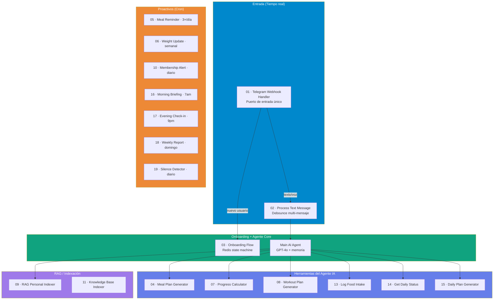
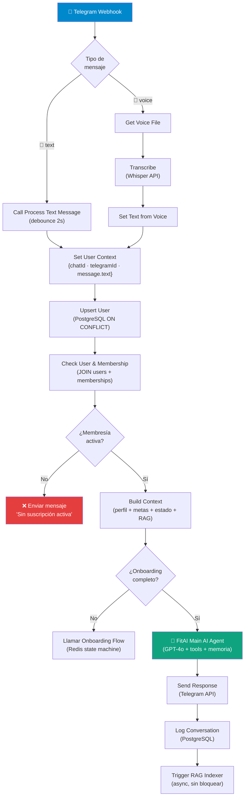
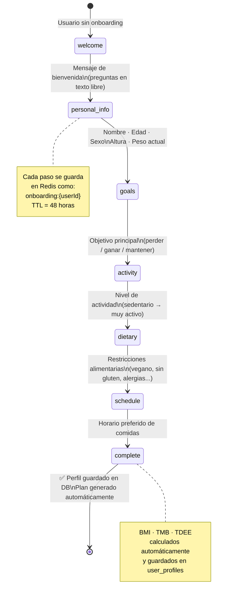
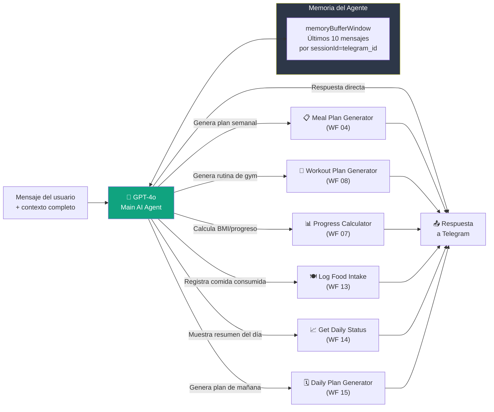
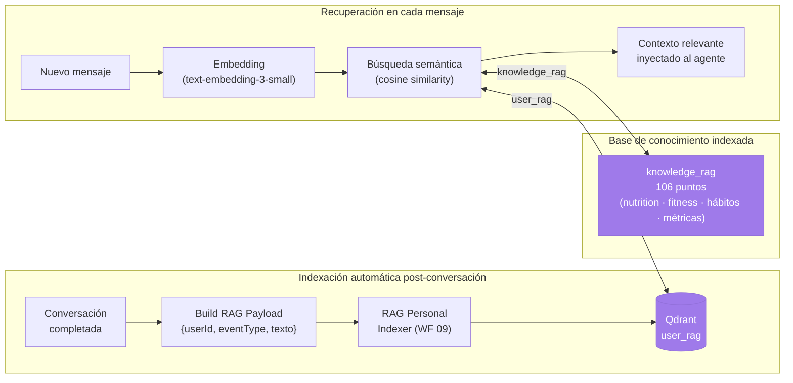

# Workflows de n8n — FitAI Assistant

19 workflows activos que implementan toda la lógica del bot: desde recibir un mensaje de Telegram hasta generar planes personalizados con GPT-4o, registrar comidas, calcular progreso y enviar mensajes proactivos.

---

## Mapa de Workflows



---

## Lista de Workflows

| # | Nombre | ID | Trigger | Estado |
|---|--------|----|---------|--------|
| 01 | `FitAI - Telegram Webhook Handler` | `fI5u4rs3iXPfeXFl` | `telegramTrigger` | Activo |
| 02 | `FitAI - Process Text Message` | `CCkMv75zwDDoj513` | executeWorkflow | Activo |
| 03 | `FitAI - Onboarding Flow` | `yiUgnJ6gCoaIFVXe` | executeWorkflow | Activo |
| 04 | `FitAI - Meal Plan Generator` | `KQhP9lQNxCKeOsbJ` | toolWorkflow | Activo |
| 05 | `FitAI - Meal Reminder Scheduler` | `SntGuE97yl9efvo5` | Cron (3×/día) | Activo |
| 06 | `FitAI - Weight Update Requester` | `tkSAHhjJnO4nTFsM` | Cron (semanal) | Activo |
| 07 | `FitAI - Progress Calculator` | `bhJ8qqZXr68Id3pH` | toolWorkflow | Activo |
| 08 | `FitAI - Workout Plan Generator` | `ETjiYAUhXfsVSyWQ` | toolWorkflow | Activo |
| 09 | `FitAI - RAG Personal Indexer` | `vAqqjXg2IE1ldgg3` | executeWorkflow | Activo |
| 10 | `FitAI - Membership Alert` | `I4Q4C6SOPY2fnK3W` | Cron (diario) | Activo |
| 11 | `FitAI - Knowledge Base Indexer` | `3uXT5ld76uIUCENn` | Manual | Activo |
| 13 | `FitAI - Log Food Intake` | `DQsnzXQWMSqJxigL` | toolWorkflow | Activo |
| 14 | `FitAI - Get Daily Status` | `J2y4wKYEugHe4Mkg` | toolWorkflow | Activo |
| 15 | `FitAI - Daily Plan Generator Cron` | `xILhDSQy0ZP40jjt` | Cron (9pm) | Activo |
| 16 | `FitAI - Morning Briefing` | `NFhsChTrhIc05uyc` | Cron (7am) | Activo |
| 17 | `FitAI - Evening Check-in` | `ErIUGcIkS5Rim65L` | Cron (9pm) | Activo |
| 18 | `FitAI - Weekly Report` | `gsIQcXRlMznc3uJ8` | Cron (domingo) | Activo |
| 19 | `FitAI - Silence Detector` | `ytuz6H8cdBm8oyTx` | Cron (diario) | Activo |

---

## Flujo del Webhook Handler (Workflow 01)

El corazón del sistema. Recibe cada mensaje de Telegram y lo enruta.



---

## Flujo de Onboarding (Workflow 03)

Recopila el perfil del usuario mediante conversación natural. Estado persistido en Redis con TTL de 48 horas.



---

## El Agente IA y sus Herramientas



---

## Workflows Proactivos (Cron)

```mermaid
gantt
    title Workflows Proactivos — Horario diario (hora Colombia)
    dateFormat HH:mm
    axisFormat %H:%M

    section Mañana
    Morning Briefing (WF 16)    :07:00, 30m
    Daily Plan Generator (WF 15):21:00, 30m

    section Recordatorios
    Meal Reminder — Desayuno (WF 05)  :08:00, 15m
    Meal Reminder — Almuerzo (WF 05)  :12:30, 15m
    Meal Reminder — Cena (WF 05)      :19:00, 15m

    section Noche
    Evening Check-in (WF 17)    :21:00, 30m

    section Fondo
    Membership Alert (WF 10)    :06:00, 15m
    Silence Detector (WF 19)    :10:00, 15m
```



**Weekly Report (WF 18)** corre los domingos a las 9am con resumen de la semana.
**Weight Update Requester (WF 06)** corre los lunes a las 8am solicitando el peso actual.

---

## Sistema RAG — Contexto Inteligente



---

## Patrones Críticos de Implementación

### Debounce multi-mensaje (Workflow 02)

Cuando el usuario envía varios mensajes seguidos rápido, el sistema espera a que termine de escribir:

```
Usuario: "hola"
Usuario: "quiero saber"
Usuario: "cuántas calorías tiene una pizza"
         ↓ (2 segundos sin mensajes)
Sistema: toma el último y responde una sola vez
```

Implementado con `INSERT ... ON CONFLICT ... GREATEST(last_ts)` + DELETE atómico.

### Contexto de usuario en el agente

Antes de cada respuesta, el agente recibe:
- Perfil (edad, sexo, peso, altura, objetivo)
- Targets del día (calorías, proteínas, carbos, grasas)
- Progreso del día (consumido vs. objetivo)
- Plan de comidas activo
- Historial reciente (memoria buffer)
- Contexto RAG relevante

### Timezone — America/Bogota en todo

```javascript
// Correcto — siempre usar:
new Date().toLocaleDateString('en-CA', { timeZone: 'America/Bogota' })

// En SQL — siempre usar:
(NOW() AT TIME ZONE 'America/Bogota')::date
```

---

## Archivos JSON de Workflows

```
n8n/workflows/
├── README.md                              # Este archivo
├── 01-telegram-webhook-handler.json
├── 02-process-text-message.json
├── 03-onboarding-flow.json
├── 04-meal-plan-generator.json
├── 05-meal-reminder-scheduler.json
├── 06-weight-update-requester.json
├── 07-progress-calculator.json
├── 08-workout-plan-generator.json
├── 09-rag-personal-indexer.json
├── 10-membership-alert.json
├── 11-knowledge-base-indexer.json
├── 13-log-food-intake.json
├── 14-get-daily-status.json
├── 15-daily-plan-generator-cron.json
├── 16-morning-briefing.json
├── 17-evening-checkin.json
├── 18-weekly-report.json
└── 19-silence-detector.json
```

---

## Credenciales Necesarias en n8n

| Credencial | Tipo en n8n | Usada por |
|-----------|------------|-----------|
| OpenAI | OpenAI API | AI Agent, Meal Plan, Workout, RAG, embeddings |
| Telegram Bot | Telegram API | Webhook Handler, cron workflows |
| PostgreSQL | Postgres | Todos los workflows |
| Redis | Redis | Onboarding (state), debounce |
| Qdrant | HTTP Header Auth | RAG Personal Indexer, Main AI Agent |

Configurar en n8n: **Settings → Credentials → Add Credential**.
Las credenciales se almacenan encriptadas con `N8N_ENCRYPTION_KEY` — nunca en los archivos JSON.

---

## Orden de Importación

```
1. Primero (sin dependencias):
   WF 04 · 07 · 08 · 09 · 11 · 13 · 14 · 15

2. Segundo (tools del agente):
   WF 02 · 03

3. Tercero (agente central):
   Main AI Agent (integrado en WF 01)

4. Último (punto de entrada + crons):
   WF 01 · 05 · 06 · 10 · 16 · 17 · 18 · 19
```

---

## Testing Local

```bash
# Simular mensaje de Telegram al handler
curl -X POST http://localhost:5678/webhook-test/fitai-telegram \
  -H "Content-Type: application/json" \
  -d '{
    "update_id": 123456,
    "message": {
      "message_id": 1,
      "from": { "id": 1435522255, "first_name": "Mauro" },
      "chat": { "id": 1435522255, "type": "private" },
      "date": 1700000000,
      "text": "¿Cómo va mi progreso esta semana?"
    }
  }'
```

Usuario de prueba con chat real: `telegram_id = 1435522255`, `user_id = 212` en DB.
