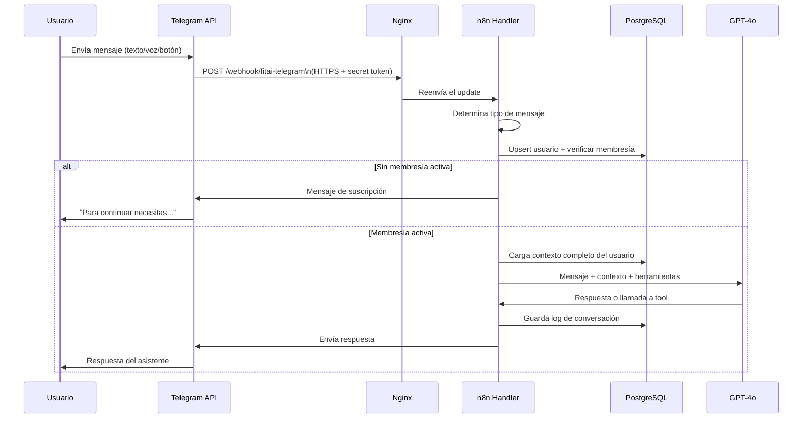
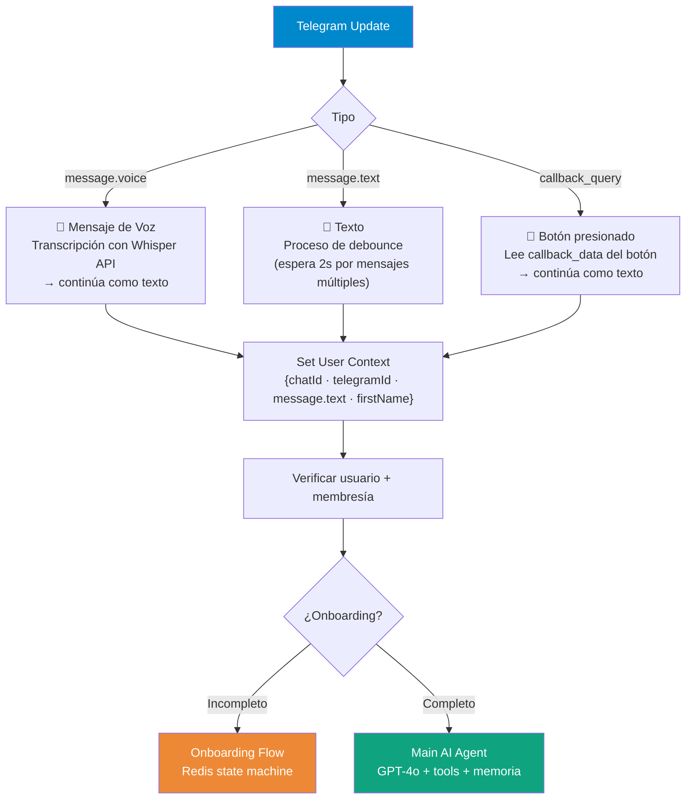
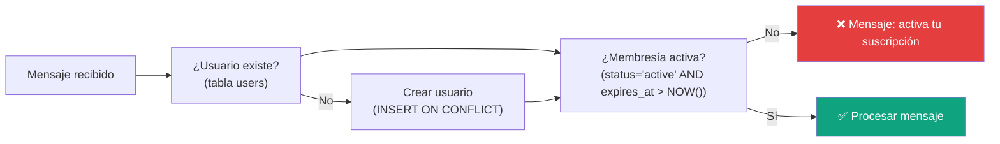

# Handlers del Bot de Telegram — FitAI Assistant

El bot **no tiene handlers en código tradicional**. Toda la lógica de manejo de mensajes está en workflows de n8n. Este directorio documenta la arquitectura lógica y su implementación en n8n.

---

## Flujo Completo de un Mensaje



---

## Tipos de Mensaje Manejados



---

## Handlers Lógicos

### Comandos de Telegram

| Comando | Acción | Implementado en |
|---------|--------|----------------|
| `/start` | Inicia onboarding (nuevo) o saluda (existente) | WF 03 - Onboarding Flow |
| `/plan` | Muestra plan de comidas o ejercicio activo | WF 01 → GPT-4o tool |
| `/progreso` | Calcula y muestra progreso actual | WF 07 - Progress Calculator |
| `/ayuda` | Mensaje de ayuda con comandos disponibles | WF 01 - respuesta directa |

### Texto Libre

Cualquier texto que no sea un comando va directamente al agente GPT-4o:

- Conversación sobre nutrición y fitness
- "comí una pizza margarita al almuerzo" → registra en log
- "¿cómo voy con mis calorías?" → consulta Daily Status
- "quiero un plan de comidas para esta semana" → genera Meal Plan
- "estoy desmotivado" → respuesta de coaching personalizada

### Voz

El mensaje de voz se transcribe con Whisper API y luego se trata como texto. El usuario puede hablar naturalmente y el bot entiende.

### Botones Inline (callback_query)

Usados principalmente durante el onboarding para opciones rápidas:

```
[Perder peso] [Ganar músculo] [Mantenerme]
[Sedentario] [Poco activo] [Moderado] [Muy activo]
```

Cada botón envía un `callback_data` que el handler lee y procesa como respuesta de texto.

---

## Verificaciones Pre-Handler

Antes de ejecutar cualquier lógica, el handler verifica en orden:



No hay verificación de rate limit individual por mensaje — el debounce de 2 segundos actúa como throttle natural.

---

## Nodos n8n que implementan los handlers

| Nodo n8n | Función del handler |
|---------|-------------------|
| `telegramTrigger` | Recibe el HTTP POST de Telegram |
| `Switch` | Determina tipo (voice / text / callback_query) |
| `Get Voice File` + Whisper | Transcripción de audio |
| `executeWorkflow` → WF 02 | Debounce multi-mensaje |
| `Set User Context` | Normaliza {chatId, telegramId, message.text} |
| `Postgres` (upsert) | Crea/actualiza usuario |
| `Postgres` (check) | Verifica membresía activa |
| `IF` → WF 03 | Enruta a onboarding si incompleto |
| `AI Agent` (GPT-4o) | Procesa mensaje con contexto |
| `Telegram Send` | Envía respuesta al usuario |

Documentación detallada de cada workflow: `docs/n8n-flows.md`

---

## Futuro: Handlers en Código

Si en fases futuras se necesita lógica que supere las capacidades de un Code node de n8n (ej: procesamiento de imágenes pesado, cálculos en tiempo real muy complejos), se podrían agregar microservicios HTTP en este directorio que n8n invoca via HTTP Request node.

```
src/bot/handlers/
├── README.md           # Este archivo
├── imageAnalysis.js    # (futuro) Análisis visual de fotos de comida
└── complexCalc.js      # (futuro) Cálculos que excedan Code node
```
